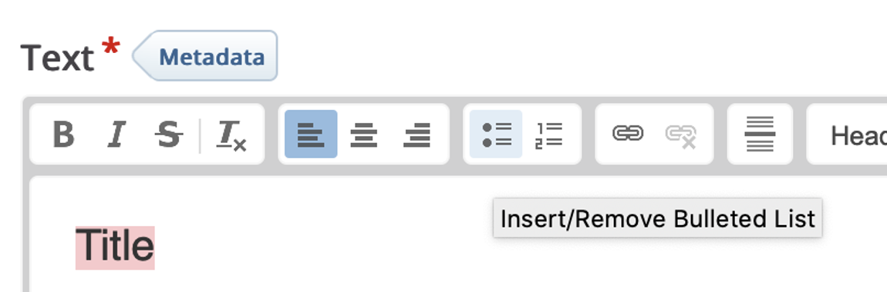
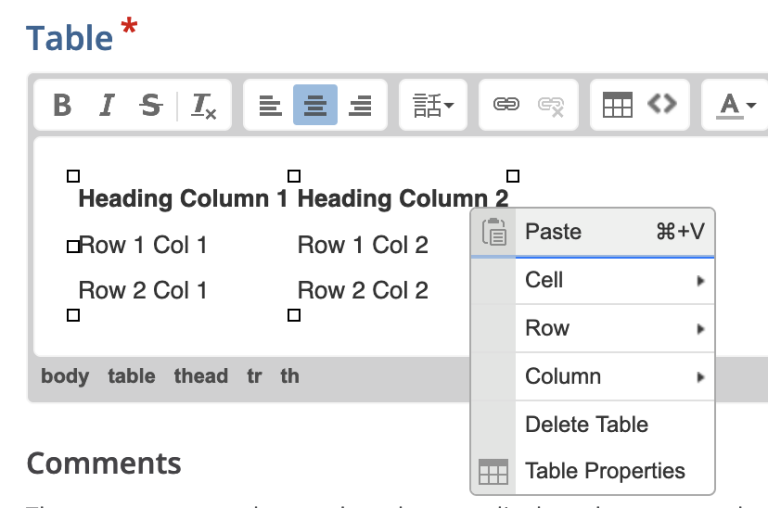

# Best Practices in Digital Accessibility - H5P

## Best practices as applied to H5P

### Set the title and language of a document: 

Fill out an object’s **Title** field

---
### Use headings to structure document content:
Wherever the rich content editor is available (e.g., Text content type):
1. Select text you would like to make into a heading
2. Select the **Paragraph Format** dropdown to the left of font size (“Normal” is the default) on the formatting toolbar
3. Select the desired heading level

Note that the dropdown list begins with **Heading 2** – this is because in H5P, an object’s **Title** field makes up (part of) its Heading 1

---
### Use built-in lists:

Wherever the rich content editor is available (e.g., Text content type):
1. Select text you would like to make into list
2. Select the I**nsert/Remove Bulleted List** or the I**nsert/Remove Numbered List** button on the formatting toolbar. _(If nothing is selected, a new list with an empty list item will be created)_
		   

---
### Write descriptive links:

Wherever the rich content editor is available (e.g., Text content type):
1. Select text you would like to make into a link
2. Select the “chain” **Link** button on the formatting toolbar
3. Enter the link in the **Link** window under URL, then select **OK.**

---
### Use built-in tables

H5P’s rich content editor does not have a button for creating a table; rather, in certain content types, including Course Presentation and Interactive Book, tables are offered as an option for insert-able content, which can then be edited using the rich content editor.

Accessible tables generally have descriptive **captions**. To add table caption:
1. Click to select a table cell
2. Right click the table cell, then click **Table Properties**
3. In the **Table Properties** window, fill in the **Caption** field, then click OK

		   

To designate a **header row, a header column, or both**:
1. Click to select a table cell
2. Right click the table cell, then click **Table Properties**
3. In the **Table Properties** window, use the **Headers** drop down menu to designate header row, column, or both, then select OK. **NOTE**: H5P sets the header cell scope for you. 

---
### Provide text alternatives for images and figures:

The exact workflow may depend on the content type. In general:
* You should see an **Alternative text** field
* You may also see a **Decorative only** checkbox, with which you can mark an image as decorative
		  

---
### Provide text alternatives for video and audio clips 

#### Captions

* **Audio clips**: There is not currently a way to directly attach synchronized captions and text transcripts to audio clips in H5P
- **Video clips**: The exact workflow depends on the content type and whether the video is uploaded to H5P or hosted on an external service (e.g., YouTube, Mediasite). In general ...
	- **Videos uploaded to H5P**: You should see something about a **video track** or **text tracks**, which may be inside an **Accessibility** tab
		- You can select the track type, for which you should select **Captions.** H5P supports .vtt files for captions
	- **Videos uploaded elsewhere**: Common video platforms used in OSO courses, such as Mediasite, Panopto, and YouTube, natively support captions. Please refer to the external services’ documentation
		  

#### Text transcript

There is not currently a way to directly attach text transcripts to audio and video clips in H5P.
* In content types in which you create rich content, such as Course Presentation, you can place a clip and a link to its text transcript (e.g., hosted on OneDrive) on the slide.
* **For externally hosted clips**, including on Mediasite, Panopto, and YouTube, text transcripts can be added as a link in the media descriptions.

#### Playback options

* **Audio clip**: Uncheck **Enable autoplay**.
* **Video clip**: Under **Playback** options, uncheck **Auto-play video** and **Loop video**.

---
### Place elements of a document in an order they are meant to be read

Reading order in H5P can be tricky as the authoring tool does not provide finer controls; in our investigations, for some content types reading order is determined by creation order, and for others location on canvas. Please consult with the MIT if you are using a H5P content type that allows for freeform creation, such ad Course Presentation and Hotspot.

---
## Additional accessibility considerations for H5P - General

In addition to implementing general best practices in digital accessibility, here are additional general considerations and relevant settings specific to H5P:

- **Audio elements**
    - Set “Player mode” to “Full”
        - Leave “Enable controls” _checked_
    - Leave “Enable autoplay” _unchecked_
- **Image elements**
    - Leave “Disable image zooming” _unchecked_
    - Add hover text
- **Video elements**
    - **Visuals**
        - If the video thumbnail is blank, you may need to identify it some other way, including adding a poster image
        - Leave “Fit video player to use all available space” _checked_
        - Leave “Show video player controls” _checked_
    - **Playback**
        - Leave “Auto-play video” _unchecked_
        - Leave “Loop video” _unchecked_
- **Text overrides and translations**
    - Local H5P recommendation: where applicable, change the text for **Check answer button** to “Submit your answer”

---
## Additional accessibility considerations for H5P - Content types

First, some important notes:
* Only the content types listed here are approved for OSO use.
* These recommendations may have been amended. Please see the vendor's guide for the latest: [Content types recommendations](https://help.h5p.com/hc/en-us/articles/7505649072797-Content-types-recommendations) 
* If you are creating a H5P object for a course from a college that participates in Local H5P, make sure you consult the local guidelines
* Some content types can be embedded within another content type; for example, Multiple Choice in Course Presentation. In such cases, observe accessibility considerations for all content types involved

### Accordion

- For **H tag for labels**, the default selection **H2** is fine; however:
    - If where the H5P object will be embedded is known in advance, set this to be one level below the heading level of the section in which it will be embedded (E.g., if embedded under **H2**, set this to **H3**)
    - For each panel, the text’s first heading should be one below, and subsequent headings should not be higher (E.g., if **H tag for labels** is **H3,**  the text’s first heading should be **H4,** and subsequent headings should not be higher than **H4**)

### Audio

- Under **Text overrides and translations**, update the **Audio content name** field to reflect the title of your audio clip

### Branching Scenario

- For text elements, check **Show content title in view**

### Complex Fill in the Blanks

- Under “behavioral settings,” leave “Automatically check answers after input” _unchecked_.

### Course Presentation

- While you can indicate document structure for individual text blocks, this content type does not currently allow you to indicate reading order (i.e., the order in which a screen reader will read the contents on each slide, which may not be the same as how they are visually presented). As such, consider using the Interactive Book content type instead

### Drag and Drop

- **NOTE**: This is not a content type approved for OSO use. These guidelines are offered here because they may be present in your collaborations
- Dropzones and draggables should have visible labels

### Fill in the Blanks

- Under **Behavioral settings**, leave **Automatically check answers after input** unchecked

### Image Slider

- Under **Text overrides and translations**, update the **Image content name** field to reflect the title of your image slider object

### Interactive Book

- Under **Behavioral settings**, uncheck **Enable automatic progress**

### Interactive Video

- **Step 1 Update/embed video, Interactive video tab**
    - Update **the title of this interactive video** to an appropriate title
    - Add a short description for the video
    - Leave **Hide title on video start screen** unchecked
- **Step 2 Add interactions**
    - Each interaction should have an appropriate title that indicates its interaction expectations

### Multiple Choice

- Under **Behavioral settings**, leave **Automatically check answers** unchecked
- Under **Media**, if a video is added, update its **Title** to reflect the title of the video

### Quiz (Questions Set)

- Avoid adding informative background images (i.e., not decorative) throughout a quiz object, as there is not currently a way to add alt text for them
- **Finished**
    - Avoid adding **Passed video** and **Failed video** as you cannot currently configure their accessibility settings.

### Single Choice Set

- Under **Behavioral settings**, uncheck **Auto continue**

### True/False Question

- Under **Behavioral settings**, leave **Automatically check answer** unchecked

### Virtual Tour

- **+ New Scene**
    - Add a scene description
    - Select the correct button style to distinguish between going to a **new scene** and showing **more information** – this seems to be purely visual information
- **Label settings**
    - Leave **Display labels** checked
- **Text overrides and translations**
    - Update **ARIA label for content type** to reflect the description of your experience

