# Best Practices in Digital Accessibility - Lectora

## Best practices as applied to Lectora

### Set the title and language of a document

To edit a page’s title, click its entry in the **Project Explorer**. Then:
* Click it again to enter edit mode; OR
* Click its **PAGE** ribbon, **PROPERTIES**, then edit its **Name** property

To edit the object/project’s title:
* Click the root element in the **Project Explorer**, then click it again to enter edit mode; OR
* Click the **DESIGN** ribbon, **Project Options** (in the **Project Setup** group), then edit the **Name** field

---
### Use headings to structure document content

In Lectora, you set an entire text element to be a certain heading level. In other words, each heading should be its own text element. To change the heading level of a text element:
1. Click to select the text element. The **TEXT** ribbon will appear at the top of the web app.
2. Click **PROPERTIES**. Use the dropdown to the right of **HTML Text Type** to set the appropriate heading level.
		   
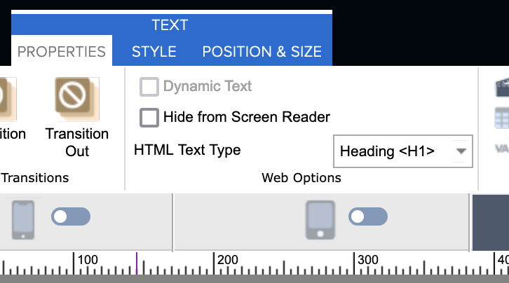

---
### Use built-in lists

Wherever the rich content editor is available (e.g., Text element):
1. Select text you would like to make into list
2. Select the I**nsert/Remove Bulleted List** or the I**nsert/Remove Numbered List** button on the formatting toolbar. _(If nothing is selected, a new list with an empty list item will be created)_
		   
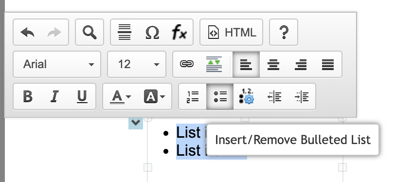

---
### Use built-in tables

To **create a new table** on a page:
1. Click the **INSERT** ribbon
2. Click the **Table** dropdown in the **Add Text** group. Use the **Insert Table** panel to create a table of a certain number of columns and rows
		   
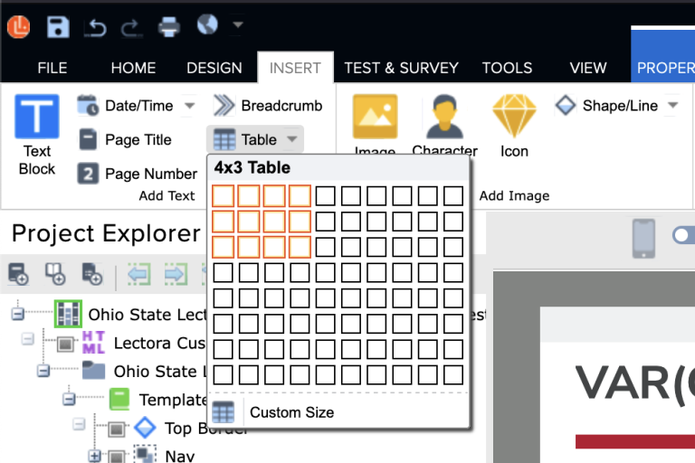

 There is not currently a way in Lectora to define **table caption** using the Rich Content Editor. Here are some options:
* Provide the caption as text immediate before or after the table
* Edit the table’s HTML

 To designate a **header row**:
1. Double-click the new table to start editing it. Click the **TEXT TABLE** ribbon
2. Click to check the **Header Row** option in the **Table** group. (In HTML, Lectora changes those cells to table headers (`<th>`) and sets their scopes to `col`. There is not currently a way in Lectora to  define row headers and row+column headers on a table using the Rich Content Editor, and you’ll need to edit the table’s HTML)
		   
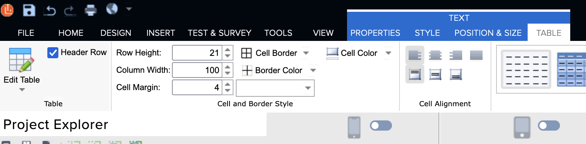

---
### Write descriptive links

Wherever the rich content editor is available (e.g., Text content type):
1. Select text you would like to make into a link
2. Select the “chain” **Link** button on the formatting toolbar. The **Text Hyperlink Properties** popup will open

Here are some of the types of links you can create in Lectora:
* Go to – page – (and scroll to location on page) – in existing or new window
* Go to web address – at address – in existing or new window
* Perform an action, such as show/hide an element and display message
		   
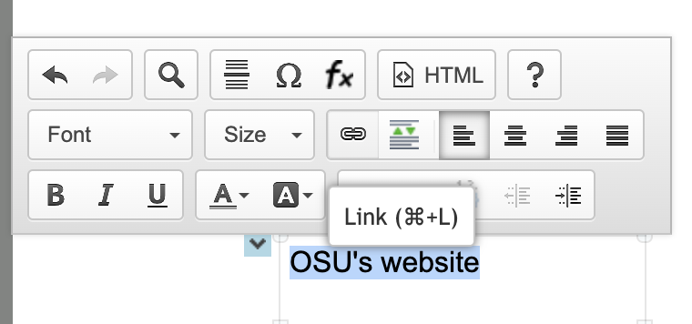
		   
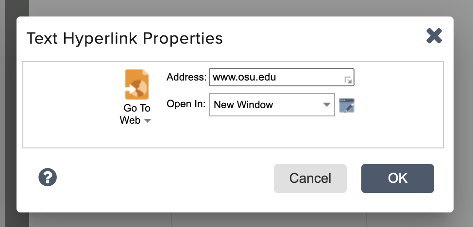

---
### Provide text alternatives for images and figures

In Lectora, alternative text for a visual, such as an image, button, or shape element, is provided via its Name property. To set the Name property of a Lectora element:
1. Make sure the project’s **Use Web Accessibility Settings** option is enabled (see the top of this page) – this automatically converts an elements **Name** value into its alternative text
2. Locate the visual element using the **Project Explorer**, then
	1. Double-click the element to edit its title; or
	2. Click to select the element, click its **ELEMENT TYPE** ribbon at the top of the web app, **PROPERTIES**, then edit its **Name** property.
3. If the visual is decorative, check its **Empty Alt Tag** checkbox (under the same settings group)
		   
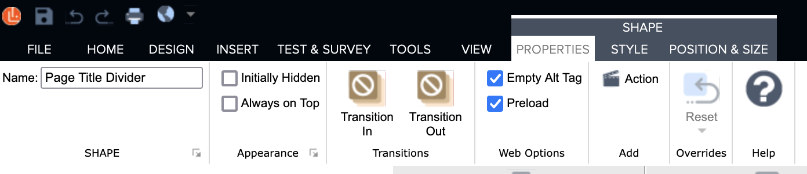

---
### Provide text alternatives for video and audio clips

#### Captions

To provide synchronized captioning to an audio or a video clip **uploaded to Lectora**:
1. Click to select the media element. The **PROPERTIES** ribbon will appear at the top of the web app
2. Click the **Add Captions** button. The **Add Captions** popup will appear
3. Click the **Caption File** dropdown, then **Browse for File** to select and upload a caption file (WebVTT, SRT, or XML) from your device
4. Click **OK** to dismiss the popup

 **Videos uploaded elsewhere**: Common video platforms used in OSO courses, such as Mediasite, Panopto, and YouTube, natively support captions. Please refer to the external services’ documentation
#### Text transcript

There is not currently a way to directly attach text transcripts to an audio or video clip in Lectora.

You can provide link to a clip’s text transcript (e.g., uploaded directly to Lectora, hosted on OneDrive) right before/after the media element on the page.

For externally hosted clips, including on Mediasite, Panopto, and YouTube, text transcripts can be added as a link in the media descriptions.

#### Playback options

Confirm the following media playback options under the element’s **PROPERTIES** ribbon:
* Uncheck **Auto Start** (unless on “audio path”)
* For an audio element, **Display** is set to **Controller**

---
### Place elements of a document in an order they are meant to be read

This technique is enhanced by other techniques that allows elements of a document to be meaningfully identified, including the use of headings, built-in lists, descriptive links, tables, and alternative text.

#### How are project elements listed in Lectora? 

The **Project Explorer** lists the elements in your project, which may be organized into pages, 

Elements can be placed outside of a page element - these are said to be **inherited**. They can be repeated on other pages, and by default they are read first and layered at the bottom.

Here is an example:
* There are pages that are part of the "Templated Pages" chapter
* The "Top Border" element and the "Nav" group of elements appear on all page elements that are part of the chapter

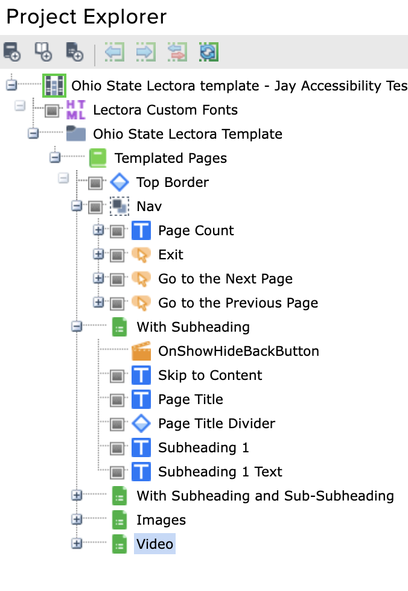

Note that *where* an element appears on a page (e.g., center of the page) is **independent** from where it appears in the Project Explorer. 

#### "Z-order"

Similar to PowerPoint, elements on a page can stack on top of each other. 

For each page, the first element appearing in the Project Explorer is layered at the very bottom, and the last element is layered at the top - in other words, this is in reversed order from how they are listed. 

An element that is higher up in the visual order obscures one that is lower; for example the last element of a page is visually stacked on top of the first element. 

If needed, under an element’s **PROPERTIES** ribbon, there is a **Always on Top** property. Note that checking this property will **also** move it to the back of the reading order, so use it sparingly.

#### Reading order

In general, use the **Project Explorer** to drag and drop your elements to put them in the order they are meant to be read.

**Notes**:
* This is the exact opposite from PowerPoint
* An element that has been marked as decorative is NOT in the reading order
* Elements inside a group element are read in the top-down order as well
	* Group elements has a special **Set Reading Order to Last** property under its **PROPERTIES** ribbon that can be toggled on
	* If there are multiple group elements marked as **Set Reading Order to Last**, they are read in the order they appear in the **Project Explorer**

#### Tab order

Actionable elements, including buttons, links, and form fields, can be focused and acted upon by hitting the Tab key. The tab order follows the reading order.

---
## Additional accessibility considerations for Lectora - General

Here are some additional digital accessibility considerations for Lectora:
- Avoid timed elements
    - If you must provide timed access to a page, be sure to provide a warning to the learner that time is about to run out, give them plenty of time to read the message and provide the option to extend the time limit
- Avoid initially hidden elements
    - Since Lectora 18, initially hidden text blocks are read by the screen reader by default when they are shown – this may result in them being read at inopportune times
- Avoid changing or updating content on the page automatically. Let the learner initiate this change
- Avoid having text that only appears upon mouse hover

See pages 43 and 44 of the [Making eLearning Accessible](../assets/eLearning-Brothers-Making-eLearning-Accessible.pdf) document (by eLearning Brothers) for an Accessibility Development Checklist that you can follow.

### Check the accessibility of your Lectora object 

#### Run the Accessibility Check tool

The Accessibility Check tool is located in the **Review** group under the **TOOLS** ribbon. Click the button to open the **508 Compliance Check** popup.

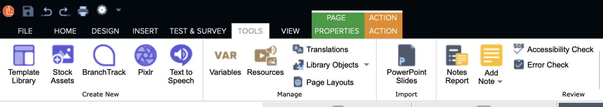

Warning messages are shown in blue, whereas error messages are shown in red. You can use the **Show errors only** and the **Show warnings only** check boxes to filter the report. You can click a warning or an error to jump directly to the element in question.

Remediate all errors. 

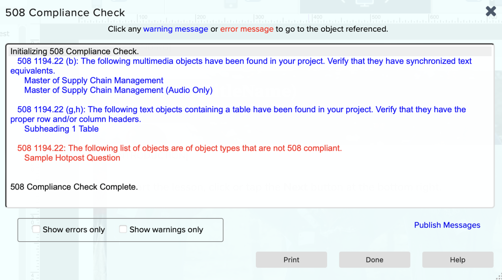

**It is important to remember that automated accessibility checkers will NOT catch all issues**. For example, Lectora’s tool cannot detect whether captions are provided for audio and video elements, nor can it detect color contrast issues.

#### Perform keyboard testing

Users who only use keyboards must be able to go through and complete your Lectora object.

Specifically, check to see if you are able to do the following:

- Tab between fields and controls like buttons, form inputs, and entry fields
- Activate buttons with the **Enter** key
- Stop, pause, and play audio and video using the keyboard
- Fill out a form
    - Cycle through radio buttons in a group with the arrow keys, then confirm selection with the **Space** key (if needed)
    - Check a check box with the **Space** key
    - Activate a drop-down list with the **Down** key, then confirm selection with the **Enter** key
    - Access keyboard shortcuts when necessary

#### Perform screen reader testing

Here are some common combinations for screen reader testing:

- On Windows, using Mozilla Firefox and [NVDA](https://www.nvaccess.org/download/), a free screen-reading software
- On macOS, iOS, and iPadOS, using Safari and VoiceOver, the built-in screen-reading tool

Screen reader testing has a higher barrier to entry than automated tools and keyboard testing, and is typically done by trained professionals in full testing. If you are interested, there is a **Accessibility Evaluation** curriculum on BuckeyeLearn.

---
## Additional accessibility considerations for Lectora - Questions/Form Elements

Here are some accessibility considerations when creating form elements in Lectora, including questions. 

Handling of form submission is beyond the scope of this article. For knowledge check activities, included graded quizzes, prefer the built-in question elements over custom-made ones.

### Shared workflows/information

- As a reminder, edit the elements’ **Name** properties for easy identification in the **Project Explorer**. You can do this directly in the **Project Explorer**, or under each elements **PROPERTIES** ribbon
- To edit a question, including its question text and options, click its **PROPERTIES** ribbon, then **Edit Question** (under the **QUESTION AND FEEDBACK** group)
- Most form input and question elements are already reasonably accessible.
- The **following question types are NOT accessible and should not be used**: Matching, Drag and Drop

### Radio button group, radio button

**Used by question type(s)**: True or false, Multiple choice _(shown as choices)_, Likert, Hotspot

**Accessibility considerations**:
- When creating for a form (i.e., not a question):
    - Start by creating a **radio button group**, then create additional **radio buttons** as needed
    - For each radio button, click its **PROPERTIES** ribbon and set its **Label** property (under the **RADIO** group) to the desired option text
    - Add an additional text element as question text (or legend) immediately before or after the radio buttons
- When creating a question type that uses form this element:
    - You would notice that for each option, its text and radio button are separate elements – Lectora makes the necessarily accessibility associations for you
- **Special notes on the Likert question element:**
    - Use with one statement only
    - Check the **Empty Alt Tag** property for the **GradientBar 1** child element
- **Special notes on the Hotspot question element:**
    - Edit the question and set its **Hotspot** property to **Radio Button/Checkbox**
    - A text element needs to be created for and associated to each radio button
        - To associate a text element with its associated radio button, click its **PROPERTIES** ribbon, and set its **Label for** property (under the **Text** group) to the radio button
        - To avoid the labels from being read twice, for each text element, click its **PROPERTIES** ribbon, and check its **Hide from Screen Reader** property (under the **Web Options** group)
            - Optionally, you can style or stack the text elements so they are not visible
    - [Provide an alt text](https://ohiostate.pressbooks.pub/otdidlssmirc/chapter/lectora-provide-text-alternatives-for-visuals/) to the hotspot image as needed (or check its **Empty Alt Tag** property)
    - Note that even when the above techniques have been applied, the Accessibility Check tool will list Hotpot question elements as errors

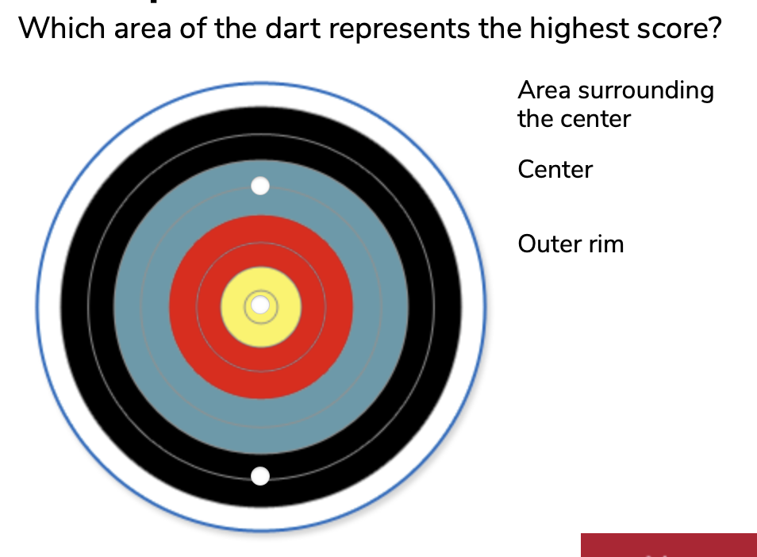

### Check Box

**Used by question type(s)**: Multiple response _(shown as check boxes)_

**Accessibility considerations**:
- When creating for a form (i.e., not a question):
    - Click its **PROPERTIES** ribbon and set its **Label** property (under the **CHECK BOX** group) to the desired option text
    - If using multiple check boxes in a group, add an additional text element as question text (or legend) immediately before or after the check boxes
- When creating a question type that uses form this element:
    - You would notice that for each option, its text and check box are separate elements – Lectora makes the necessarily accessibility associations for you

### Entry field

**Used by question type(s)**: Fill in the Blank, Number Entry, Short Answer, Essay

**Accessibility considerations**:
- When creating for a form (i.e., not a question):
    - To configure a entry field for different purposes (e.g., max characters, multi-line, numbers only), click the **ENTRY FIELD PROPERTIES** ribbon and set its **Behaviors** properties
    - Add an additional text element as label for the entry field
        - The text should include an example input, if applicable
            - Optionally, set the entry field’s **Initial** property (under the **PROPERTIES** ribbon, **Value** group) to an example input
        - To associate it with its associated entry field, click its **PROPERTIES** ribbon, and set its **Label for** property (under the **Text** group) to the entry field
- When creating a question type that uses form this element:
    - Depending on the type of question, the entry field’s **Behaviors** properties are set differently
    - A text element associated with the entry field is automatically created and configured for you

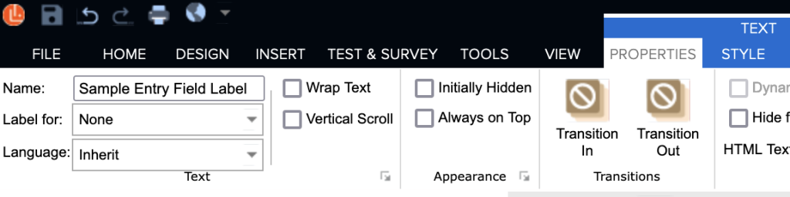

### Drop-down list

**Used by question type(s)**: Rank/Sequence, Multiple choice _(shown as droplist)_

**Accessibility considerations**:
- When creating for a form (i.e., not a question):
    - Add an additional text element as label for the drop-down list
        - To associate it with its associated drop-down list, click its **PROPERTIES** ribbon, and set its **Label for** property (under the **Text** group) to the drop-down list
- When creating a question type that uses form this element:
    - A text element associated with the drop-down list is automatically created and configured for you

### List box

**Used by question type(s)**: Multiple response _(shown as listbox)_

**Accessibility considerations**:
- When creating for a form (i.e., not a question):
    - Add an additional text element as label for the list box
        - To associate it with its associated drop-down list, click its **PROPERTIES** ribbon, and set its **Label for** property (under the **Text** group) to the list box
- When creating a question type that uses form this element:
    - A text element associated with the drop-down list is automatically created and configured for you