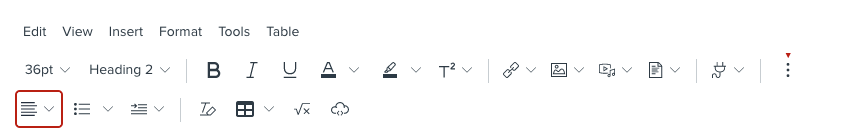

# Module 5: CSS – Common Units and Text Formatting

In this module, you will first learn about what a CSS declaration looks like; in other words, how do you write the CSS to make something look the way you want it to. Then, you will learn about the common units that you will encounter when working with CSS – lengths and colors. You will also learn some CSS properties for formatting text.

## Learning Outcomes

In this module, our content and activities will help you to be able to do the following:

- Create a CSS declaration
- Describe common CSS length units, including pixel (`px`) and relative size to parent (`em`, `%`)
- Describe common CSS color representations, including keywords (e.g., `red),` hexadecimal (e.g., `#FF0000`), and RGB (red-green-blue; e.g., ``rgb(255, 0, 0)``)
- Describe common CSS properties for text formatting, including text alignment (`text-align`), font size (`font-size`), font weight (`font-weight`), font (`font-family`), text color `(color),` and background color (`background-color`)

## Mini-Module 5.1: Length and Size Units 

Here are some length and size units commonly used in CSS:

- **`px` (Pixel)**: How big a pixel is “physically” depends on various factors and is beyond the scope of this guide.
    - When working in the Carmen RCE, you would generally insert an item using the WYSIWYG editor (e.g. image, iframe) and adjust based on the original value(s)
        - **Example:** <span style="font-size: 16px;">16px text</span>; <span style="font-size: 20px;">20px text</span>
- **`em:`** This refers to the font size of a HTML element’s parent element (1 em), which may be the viewer’s default font size for the page if not customized.
    - The number in front of the unit is a multiplier; for example, 1.2 em means 1.2x, or 120%, of the parent element’s font size
        - **Example:** 1em text; <span style="font-size: 1.2em;">1.2em text</span>
    - As another example, an element with height of `2em` is as tall as two characters in the same parent element stacked vertically
- **`%` (Percent)**: Percentage is calculated with respect to the measurements of a HTML element’s parent element
    - For example, an element with width of `100%` is as wide as its parent element’s content area (see the mini-module on the CSS Box Model)
    - As another example, a character with font size of `150%` is 1.5 times as big as how big the text in this parent element would otherwise be
        - Example: 100% text; <span style="font-size: 150%;">150% text</span> (same as 1.5em)
## Mini-Module 5.2: Color Values

Here are some common ways color is expressed in CSS:

- **Keywords:** For example, white, <span style="color: white; background-color: black;">black</span>, <span style="color: black; background-color: yellow;">yellow</span>
    - Sorry, scarlet is not a built-in color, and "gray" is not the official OSU gray
- **Hexadecimal**: Specifies how much red, green and blue is in a color (in that order)
    - Each color is represented with a number of up to 255 in hexadecimal (base 16) form (i.e. from 00 to FF)
    - For example, OSU scarlet is <span style="color: white; background-color: #BA0C2F;">#BA0C2F</span>, and OSU gray is <span style="color: black; background-color: #A7B1B7;">#A7B1B7</span> (i.e. combination of all red and all blue)
- **RGB** (Red-Green-Blue): Specifies how much red, green and blue is in a color (in that order)
    - Same idea as hexadecimal, except expressed in base 10 form
    - For example, <span style="color: white; background-color: rgb(255, 0, 0);">red</span> is `rgb(255, 0, 0)`, and <span style="color: white; background-color: rgb(255, 0, 255);">mangenta</span> is `rgb(255, 0, 255)`.

## Mini-Module 5.3: Text Formatting

Here are some commonly-used CSS properties for text formatting and the value unit(s) for them:

- `text-align`: [keyword](https://developer.mozilla.org/en-US/docs/Web/CSS/text-align)
    - Horizontal alignment of content inside a block element or table cell
- `font-size`: [length unit](https://ohiostate.pressbooks.pub/otdidlsshtmlcsstraining/chapter/mini-module-5-1-length-and-size-units/) or [keyword](https://developer.mozilla.org/en-US/docs/Web/CSS/font-size)
- `font-weight`: number between 100 to 900; or [keyword](https://developer.mozilla.org/en-US/docs/Web/CSS/font-weight)
    - 400 is normal, and 700 is **bold**
- `font-family`: list of 1 or more [font(s)](https://developer.mozilla.org/en-US/docs/Web/CSS/font-family)
    - Font selection; for example, <span style="font-family: 'Comic Sans MS';">Comic Sans</span>
    - List provides backup choices in order if a viewer’s device does not have a font installed
- `color:` [color](https://ohiostate.pressbooks.pub/otdidlsshtmlcsstraining/chapter/mini-module-5-3-color-values/)
    - Foreground (e.g. text) color
- `background-color`: [color](https://ohiostate.pressbooks.pub/otdidlsshtmlcsstraining/chapter/mini-module-5-3-color-values/)
    - Background color

### In the WYSIWYG

In the WYSIWYG editor, use the various formatting options on the formatting toolbar, or under the “Format” menu, to format text.

**Note:** `font-weight` cannot be fine-tuned in the WYSIWYG editor.

## Mini-Module 5.4: What Does a CSS Declaration Look Like?

CSS declarations are structured as follows:

- **Property**, which is the _what_ of what you want to customize
- Colon (`:`) that follows the property
- **Value,** which is the _how_ of your customization
- Semicolon (`;`) that concludes the declaration; the semicolon also separates one declaration from another

Here is a sample CSS declaration that sets the width of a HTML element to 50 pixels and its height to 100 pixels; you will learn about CSS length unit later on:

```css
width: 50px; height: 100px;
```

Many HTML element can be styled with the same CSS properties – typically, if you think a property can be applied to a certain HTML element, you are probably right!

### Where to Write CSS Declarations in Your HTML Code?

You might be thinking, “Wait a second, I thought `width` is a HTML attribute!” And you would be right, too.

Recall the “HTML Attributes – Basics” mini-module: Some styling code, including the `width` and `height` attributes for ``, as well as the `border` and `cellpadding` attributes for `<table>`, can also be set in a HTML element’s `style` attribute.

Here are three common methods for writing styling code:

- As attributes of a HTML element that supports them
    - For example, `<video width="320" height="240">`. Note the use of the equal (`=`) signs, the attributes being separated by space, and that the values are wrapped in quotation marks (`"`)
- As CSS declarations in a separate CSS file, which is beyond the scope of this training
- As CSS declarations in a HTML element’s `style` attribute (i.e. “Inline Styles”)
    - For example, `<video style="width: 320px; height: 240px;">`. Note that the CSS declarations make up the value that is assigned to the `style` attribute

You will practice the third method in a later module.

### In the WYSIWYG Editor

You can adjust _some_ styling options for _some_ HTML elements that you can directly edit in the WYSIWYG, including text formatting, image size, and table stylings. In some cases, the WYSIWYG will prefer HTML attributes over CSS properties (via the `style` attribute). You are not able to edit or style certain elements in the WYSIWYG, including `<div>` containers and `<iframe>` embedded webpages.

## Mini-Module 5.5: Inline Styles in Practice 

Let’s put together what you have learned in this module so far by writing some inline styles.

For example, here’s a styled paragraph (`<p>`) with characters styled with inline containers (`<span>`):

<p style="align: center;">This is a center-aligned paragraph with <strong>bold</strong> and <span style="color: red; background-color: yellow;">red text on yellow background.</span></p>

Here’s a breakdown of the stylings:

- The paragraph (`<p>`) is centered (`text-align`) and 1.2 times bigger than normal text in its parent container (`font-size`, at `1.2em`)
- The word “bold” is styled inside an inline container (`<span>`) using font-weight of `700`
- The words “red text on yellow background” is styled inside an inline container (`<span>`)
    - Using the `background-color` property with value of `yellow`
    - Using the `color` property with value of `red`

Here is how the example is expressed in code; for clarity and easier reading, comments and arbitrary new lines have been added:

```html
<p style="
text-align: center;
font-size: 1.2em;">
This is a center-aligned paragraph with
<span style="font-weight: 700;">bold</span>
and
<span style="
background-color: yellow;
color: red;">
red text on yellow background</span>
</p>
```

### In the WYSIWYG Editor



This is much more easily done in the WYSIWYG – don’t feel like you have to manually code it. Once you have highlighted the paragraph, you can then use the WYSIWYG to style it accordingly:

- **Centering**: Click the 3-dot “More…” icon, click the “Align” drop-down menu, then click “Center Align”
- **Font size**:  Click the “Font sizes” drop-down menu (default value is 12pt), then select “14pt” (approximately 1.2 times bigger)
- **Bold**: Click the “Bold” (“B”) icon
- **Text color**: Clock the “Text color” drop-down menu (looks like underlined “A”), then click a yellow block
- **Background color**: Click the “Background color” drop-down menu (looks like underlined marker icon), then click a red block

