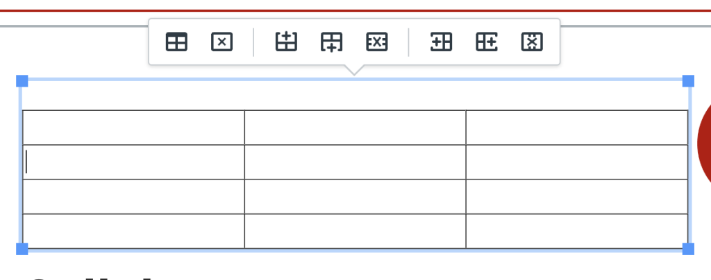

# Module 4: HTML – Semantics

In this module, you will learn about HTML elements that you can use to add semantics / meaning to your web content in support of digital accessibility – links, lists, and tables.

## Learning Outcomes

In this module, our content and activities will help you to be able to do the following:

- Create the following elements: headers (`<h1>` – `<h6>`), unordered list (`<ul>`), ordered list (`<ol>`), list item (`<li>`)
- Create an data table using the following elements: table (`<table>`), table caption (`<caption>`), table header (`<thead>`), table body (`<tbody>`), table row (`<tr>`), table data cell (`<td>`), table header cell (`<th>`, with the `scope` attribute)

## Mini-Module 4.1: Headers

Headers (`<h1>` – `<h6>`) are semantic elements that help denote the structure of your web content. Just like the chapters in a book, headers should be in logical, hierarchical order.

Here is an example:

- Part 1 (Header 1)
    - Chapter 1 (Header 2)
        - Section 1.1 (Header 3)
            - Subsection 1.1.1 (Header 4)
        - Section 1.2 (Header 3)
    - Chapter 2 (Header 2)
- Part 2 (Header 1)

Here’s the equivalent HTML code (note that the list format above is for demonstration purposes only):

```html
<h1>Part 1</h1>
    <h2>Chapter 1<h2>
        <h3>Section</h3>
            <h4>Subsection</h4>
        <h3>Section</h3>
    <h2>Chapter 2</h2>
<h1>Part 2</h1>
```

Screen reader users can jump directly to a header, which helps with navigation.

### In the WYSIWYG Editor

You can change the text style to a header using the formatting toolbar (“Paragraph” is default), or the  “Formats > Headings” option under “Format” menu.


## Mini-Module 4.2: Links

Links (`<a>`) are shortcuts to another webpage, a file attachment, or even another location on the same webpage:

- `<a>` is an inline element
- Link destination is supplied via the `href` attribute
- Link text is supplied between the opening and the close tags
    - The text should be succinct and informative; for example, prefer “Visit the OSU Homepage” over “Click Here”
    - If the content will also be used in print, you can also include the link destination itself
- If you want the link to open in a new browser tab or window, add the `target` attribute and assign it a value of “`_blank`”
    - **Note:** that this may be disorienting for assistive technology users, and Carmen automatically adds a hidden message for these links: “Links to an external site”

Here is an example: [OSU Homepage](https://www.osu.edu).

And here is how it is expressed in HTML code; for easier reading, arbitrary new lines have been added:

```html
<a
href="https://www.osu.edu"
target="_blank">
OSU Website
</a>
```

### In the WYSIWYG Editor

You can add the following types of links using the corresponding icons on the formatting toolbar, or the “Link” option under the “Insert” menu:

- Link, document, external app
- Picture, media (select “Display Text Link” to add link)

The WYSIWYG editor does not let you specify whether a link should open in a new browser tab/window.

To modify an existing link, click it to reveal the “Link Options” and “Remove Link” options.


For reference, here is how the above example is expressed in HTML code; for easier reading, code for the link itself (i.e., wrapped in `<a>`) is italicized, and arbitrary new lines were added:

```html
<p>
<em><strong>what to do:</strong>
Read through this page for an overview of the week and visit the
<a class="inline_disabled" title="Link" href="http://www.osu.edu" target="_blank" rel="noopener noreferrer"›OSU Website</a>
</em>
</p>
```

## Mini-Module 4.3: Lists

Lists are collections of items (`<li>`). Lists can either be ordered (`<ol>`) or unordered (`<ul>`).

Always use a programmatic list for a collection of items (vs. list manually created with, for example, dashes, asterisks, and keyboard spaces/tabs for indent).

Here is an example of an unordered list:

- Apple
- Banana
- Citrus

And here is how the unordered list is expressed in HTML code:

```html
<ul>
    <li>Apple</li>
    <li>Banana</li>
    <li>Citrus</li>
</ul>
```

Here is an example of an ordered list:

1. Do this
2. Then do this
3. And finally do this

And here is how the ordered list is expressed in HTML code:

```html
<ol>
    <li>Do this</li>
    <li>Then do this</li>
    <li>And finally do this</li>
</ol>
```

### Nested Lists

Lists can be nested (i.e. sublists) regardless of types.

Here is an example of a nested mixed list:

- Task A
- Task B
    1. Task B, Step 1
    2. Task B, Step 2
- Task C

And here is how the list is expressed in HTML code; note the placement of the closing `</li>` tag on Task B – it is placed at the end of its nested ordered list:

```html
<ul>
    <li>Task A</li>
    <li>Task B
        <ol>
            <li>Task B, Step 1</li>
            <li>Task B, Step 2</li>
        </ol>
    </li> <!-- Here is Task B's closing li -->
    <li>Task C</li>
</ul>
```

As another example, here is a more complicated nested list that you saw in an earlier mini-module:

- Part 1 (Header 1)
    - Chapter 1 (Header 2)
        - Section 1.1 (Header 3)
            - Subsection 1.1.1 (Header 4)
        - Section 1.2 (Header 3)
    - Chapter 2 (Header 2)
- Part 2 (Header 1)

And here is how the list is expressed in HTML code; note the placement of the closing `</li>` tags:

```html
<ul>
    <li>Part 1 (Header 1)
        <ul>
            <li>Chapter 1 (Header 2)
                <ul>
                    <li>Section 1.1 (Header 3)
                        <ul>
                            <li>Subsection 1.1.1 (Header 4)</li>
                        </ul>
                   </li>  <!-- Here is Section 1.1's closing li -->
                   <li>Section 1.2 (Header 3)</li>
                </ul>
            </li>  <!-- Here is Chapter 1's closing li -->
            <li>Chapter 2 (Header 2)</li>
        </ul>
    </li>  <!-- Here is Part 1's closing li -->
    <li>Part 2 (Header 1)</li>
</ul> 
```

### In the WYSIWYG Editor

To create a list, use the list and indent icons on the formatting toolbar.

## Mini-Module 4.4: Tables – Basics 

Tables (`<table>`) are used to present data.

Always use a programmatic table for tabular data (vs. table manually created with keyboard spaces/tabs).

**Note:** While it may be tempting to use `<table>` for layout purposes, don’t. Use containers such as `<div>` instead; this is an advanced topic for later on in this training.

Here is a basic example that we will build on throughout this section; the table has:

- 3 columns and 4 rows
- 1 header row
- 1 header column

<table>
<caption>Week Planner</caption>
<thead>
<tr style="height: 16px">
<th style="width: 33.3333%;height: 16px" scope="col">Meal</th>
<th style="width: 33.3333%;height: 16px" scope="col">Monday</th>
<th style="width: 33.3333%;height: 16px" scope="col">Tuesday</th>
</tr>
</thead>
<tbody>
<tr style="height: 16px">
<th style="width: 33.3333%;height: 16px" scope="row">Breakfast</th>
<td style="width: 33.3333%;height: 16px">Eggs</td>
<td style="width: 33.3333%;height: 16px">Toast</td>
</tr>
<tr style="height: 16px">
<th style="width: 33.3333%;height: 16px" scope="row">Lunch</th>
<td style="width: 33.3333%;height: 16px">Sub</td>
<td style="width: 33.3333%;height: 16px">Sandwich</td>
</tr>
<tr style="height: 16px">
<th style="width: 33.3333%;height: 16px" scope="row">Dinner</th>
<td style="width: 33.3333%;height: 16px">Steak</td>
<td style="width: 33.3333%;height: 16px">Fish</td>
</tr>
</tbody>
</table>

### Table, Caption, Rows, and Data Cells

A basic table consists of of rows (`<tr>`) of data cells (`<td>`). Typically, you can tell the number of columns in a table by counting the number of cells in the first row.

Rather than giving a table its caption by entering text directly above or underneath it, add a caption (`<caption>`) element directly after the opening `<table>` tag to provide a brief description of the table content.

Here is a first step to how the table is expressed in HTML code with rows, data cells, and caption:

```html
<table>
    <caption>Meal Planner</caption>
    <tr>
        <td>Meal</td>
        <td>Monday</td>
        <td>Tuesday</td>
    </tr>
    <tr>
        <td>Breakfast</td>
        <td>Eggs</td>
        <td>Toast</td>
    </tr>
    <tr>
        <td>Lunch</td>
        <td>Sub</td>
        <td>Sandwich</td>
    </tr>
    <tr>
        <td>Dinner</td>
        <td>Steak</td>
        <td>Fish</td>
    </tr>
</table>
```

And here’s our current progress; note that _visually_ it is unclear which cells are headers, and this indicates a likely lack of _semantics_:

<table>
    <caption>Meal Planner</caption>
    <tr>
        <td>Meal</td>
        <td>Monday</td>
        <td>Tuesday</td>
    </tr>
    <tr>
        <td>Breakfast</td>
        <td>Eggs</td>
        <td>Toast</td>
    </tr>
    <tr>
        <td>Lunch</td>
        <td>Sub</td>
        <td>Sandwich</td>
    </tr>
    <tr>
        <td>Dinner</td>
        <td>Steak</td>
        <td>Fish</td>
    </tr>
</table>

### In the WYSIWYG Editor

You can add a table using the table icon on the formatting toolbar, or the “Table” option under the “Insert” menu:

1. Use your mouse to shade in the number of rows and columns that you want in your table
2. Click anywhere in the table, and select the table properties icon (first icon) on the floating toolbar
3. Check “Show caption” to create a blank line on top of the table where you can add the caption




(For reference, here is a no-narration video that demos the [core experience of working with tables using the WYSIWYG and HTML editors](https://mediasite.osu.edu/Mediasite/Play/232a32ce98904a488b15035bcece790b1d))

## Mini-Module 4.5: Tables – Semantics (Part 1)

In the mini-module, we will build upon the table that we started creating in the “Tables – Basics” mini-module.

### Table Header, Table Body, Header Row, Header Cells, and Header Scope

To further describe the relationship of data in table, let’s make the first row a header row. This is a two-step process:

1. Separate the rows into header (`<thead>`) and body (`<tbody>`) groups
2. Change the cells in the header row to header cells (`<th>`)
    - Also, set a header cell’s `scope` attribute to describe the group of cells it is the header of (e.g. `row` or `col`; we want the latter in this case)

Screen reader users can use information about the relationships between table cells to help them navigate and stay in the context; for example,  the “Eggs” cell may now be read as “Monday, Breakfast, Eggs”.

Here is how the table’s HTML is updated to incorporate these features; comments are added for clarity:

```html
<table>
    <caption>Meal Planner</caption>
    <!-- NEW: Header row -->
    <thead>
         <tr>
            <!-- NEW: Header cells with column scope -->
            <th scope="col">Meal</th>
            <th scope="col">Monday</th>
            <th scope="col">Tuesday</th>
        </tr>
    </thead>
    <!-- NEW: Table Body -->
    <tbody>
        <tr>
            <td>Breakfast</td>
            <td>Eggs</td>
            <td>Toast</td>
        </tr>
    <!-- Abridged -->
    </tbody>
</table>    
```

And here’s our current progress; note that we can now visually distinguish the column headers, and this indicates a likely inclusion of semantics:

<table>
<caption>Meal Planner</caption>
<thead>
<tr>
<th scope="col">Meal</th>
<th scope="col">Monday</th>
<th scope="col">Tuesday</th>
</tr>
</thead>
<tbody>
<tr>
<td>Breakfast</td>
<td>Eggs</td>
<td>Toast</td>
</tr>
<tr>
<td>Lunch</td>
<td>Sub</td>
<td>Sandwich</td>
</tr>
<tr>
<td>Dinner</td>
<td>Steak</td>
<td>Fish</td>
</tr>
</tbody>
</table>

### In the WYSIWYG Editor

This is done via a two-step process:

1. Click on a cell in the first row (i.e. row to be made a header row), click the table icon on the formatting toolbar or the “Table” menu, then “Row”, “Row properties”.
    1. Change “Row type” to “Header”.
2. Highlight the cells in the header row, click the table icon on the formatting toolbar or the “Table” menu, then “Cell”, “Cell Properties”.
    1. Change “Cell Type” to “Header cell”, and “Scope” to “Column”


## Mini-Module 4.6: Tables – Semantics (Part 2)

(In the mini-module, we will build upon the table that we continued working on in the “Tables – Semantics Part 1” mini-module)

### Header Column

While HTML does not have a concept of header column, you can:

1. Make a cell the header cell for a row; and
2. Set its `scope` value to “row” (i.e. “row header”)

Here is how the the first column’s HTML is updated to incorporate these features; comments are added for clarity:

```html
<table>
    <!-- Abridged -->
    <tbody>
        <tr>
            <!-- NEW: Row header -->
            <th scope="row">Breakfast</th>
            <td>Eggs</td>
            <td>Toast</td>
        </tr>
        <tr>
            <!-- Also row header -->
            <th scope="row">Lunch</th>
            <td>Sub</td>
            <td>Sandwich</td>
        </tr>
        <tr>
            <!-- Also row header -->
            <th scope="row">Dinner</th>
            <td>Steak</td>
            <td>Fish</td>
        </tr>
    </tbody>
</table>
```

And here’s our current progress; note that we can now _visually_ distinguish both the column and row headers, and this indicates a likely inclusion of _semantics_:

<table>
<caption>Meal Planner</caption>
<thead>
<tr>
<th scope="col">Meal</th>
<th scope="col">Monday</th>
<th scope="col">Tuesday</th>
</tr>
</thead>
<tbody>
<tr>
<th scope="row">Breakfast</th>
<td>Eggs</td>
<td>Toast</td>
</tr>
<tr>
<th scope="row">Lunch</th>
<td>Sub</td>
<td>Sandwich</td>
</tr>
<tr>
<th scope="row">Dinner</th>
<td>Steak</td>
<td>Fish</td>
</tr>
</tbody>
</table>

### In the WYSIWYG Editor

Highlight the cells in the header column, click the table icon on the formatting toolbar or the “Table” menu, then “Cell”, “Cell Properties”. Change “Cell Type” to “Header cell”, and “Scope” to “Row”.

