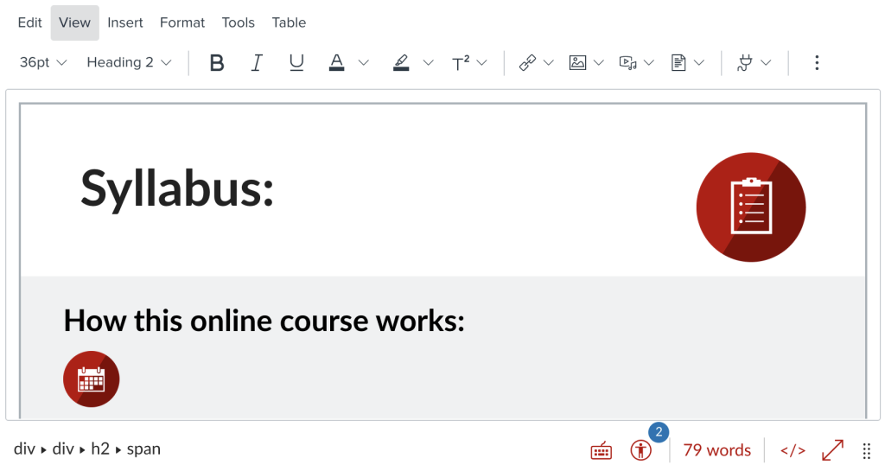
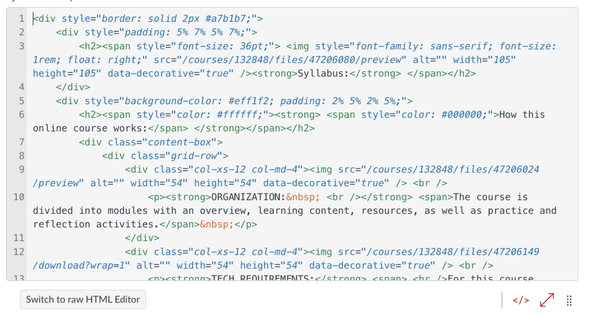
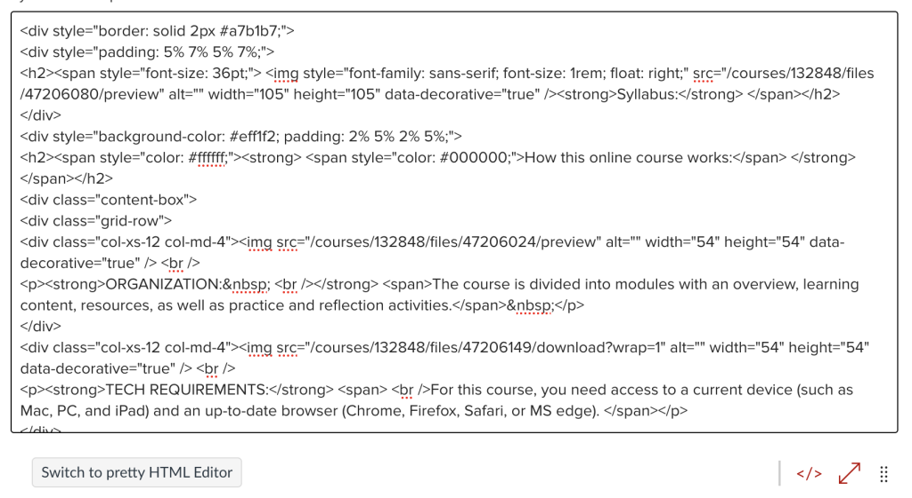

# Module 1: Just the Basics

In this module, you will first learn about some of the building blocks of web, namely HTML and CSS. You will also learn about what a What-You-See-Is-What-You-Get (WYSIWYG) editor is, as well as Carmen’s version of it, the Rich Content Editor (RCE). Should you need them, there are optional resources in this module to help you familiarize yourself with the RCE.

## Learning Outcomes

In this modules, our content and activities will help you to be able to do the following:

- Describe what HTML and CSS are
- Explain what a WYSIWYG is
- Describe how web content is edited in Carmen

## Mini-Module 1.1: The Building Blocks of Web

### What is HTML?

HTML is the building block of web content. It is markup language, which means that code is used to lay out what is visually on a webpage. Some HTML elements carry semantics, meaning that they describe how the content on a webpage is organized, and this is important for digital accessibility, which the later modules will touch on.

### What is CSS?

CSS is a _style sheet language_ commonly used to style an HTML document. When applying styling to your web content in Carmen, you will typically see CSS code interwoven with your HTML code (inline style), rather than in a separate style sheet document.

The “C” in CSS stands for “cascading”, meaning that a style set on an HTML element applies to the elements that it contains (e.g. “make all words in this paragraph gray”), but a more specific style will take precedence (e.g. “make this word scarlet”).

### Still unclear?

It’s ok if much of this don’t make sense yet – it will become clearer as you learn about more pieces of the puzzle. This course is not meant to be comprehensive; rather, it will give you just enough to be able to decipher and tinker with HTML and CSS code that you will commonly encounter when working in Carmen.

## Mini-Module 1.2: WYSIWYG and the Carmen RCE

WYSIWYG stands for “What You See is What You Get”. You can use WYSIWYG editors to create and modify web content visually, just like how you would create and edit a document in a word processor like Microsoft Word. Underneath, the content that you create is still expressed in HTML.

The Carmen Rich Content Editor (RCE) is an example of a WYSIWYG editor. The Carmen RCE is used for many purposes, including creating an announcement, a page, as well as instructions for an assignment, quiz, or discussion.

The RCE has two modes, which you can toggle using the `</>` icon at the bottom right of the editor:

- The _rich text editor_, which is the WYSIWYG editor; and
- The _html editor_, which is the code editor
    - The _Pretty HTML Editor_, which can be turned on using the link at the bottom left of the html editor, automatically formats the code with colors and indentations. This mode can be helpful for folks who are not as familiar with HTML, or for when you work with longer or more complex page
    - The _Raw HTML Editor_, on the other hand, may be preferred by folks with more experience; there is currently a limitation with the Pretty HTML Editor in which the browser’s “find” functionality may not work with code that is not in view

### Resources

If you are interested in learning more about the Carmen RCE, check out the [Rich Content Editor (All Users)](https://community.canvaslms.com/t5/Video-Guide/Rich-Content-Editor-All-Users/ta-p/383140) video by the vendor.

