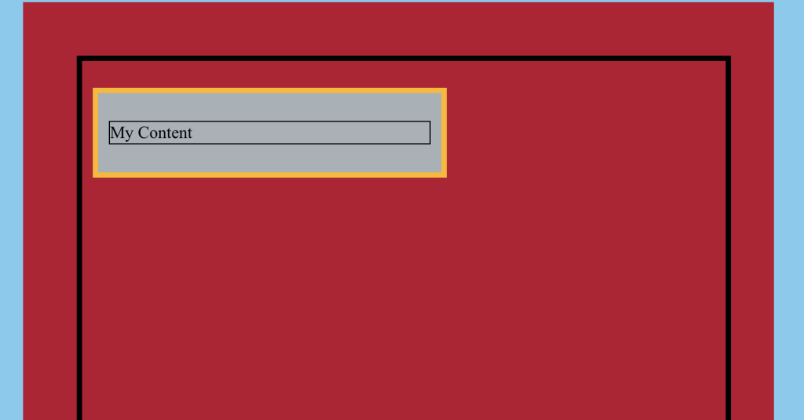

# The CSS Box Model – Complete Example

This is the complete example of a page (shown in light blue) that contains the following:

- A `<div>` container (shown in scarlet) with its content area shown in thick black border
- A child `<div>` container (shown in gray) inside the scarlet container, with
    - Thick yellow border
    - Its content area shown in thin black border
    - A paragraph (`<p>`) that says “My Content”



And here is the complete code (the page itself, the background colors, and the content area borders are not shown in code; comments are added for clarity):

```html
<div style="width: 600px; height: 1000px; padding: 50px;">
<!-- Thick black border represents content area -->
    <div style="width: 50%; padding: 10px; margin: 25px 10px 25px 10px; border: 5px solid yellow;">
        <!-- Thin black border represents content area -->
        <p>My Content</p>
</div>
```
