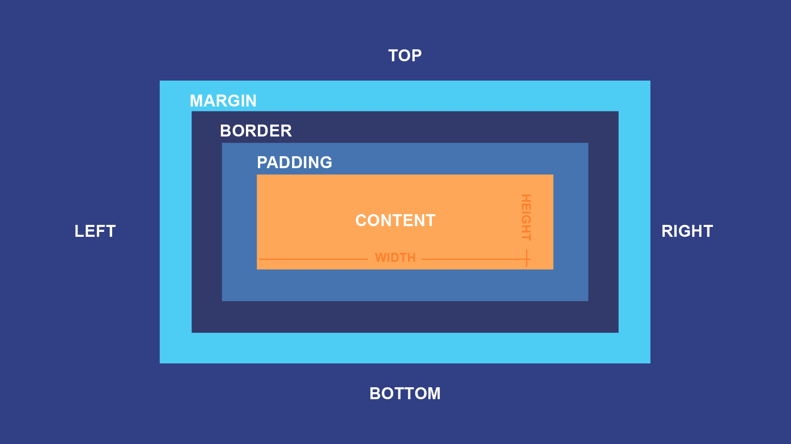
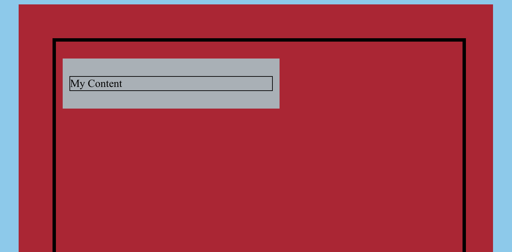
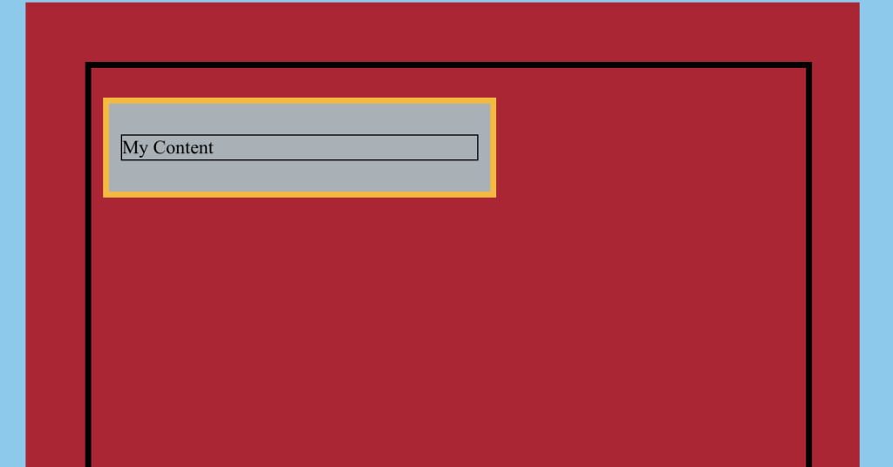

# Module 6: CSS – The Box Model

In this module, you will learn about the CSS Box Model, which will help you style containers in your web content so they look the way you want. Then, you will learn about what “cascading” means in “Cascading Stylesheet”, which will also be helpful with styling containers.

## Learning Outcomes

In this module, our content and activities will help you to be able to do the following:

- Apply the CSS Box Model – size `(width,height),` border (`border`, `border-color`, `border-style`, `border-width`), `padding,` and `margin`
- Describe how “cascading” works in terms of CSS styling

## Mini-Module 6.1: The CSS Box Model – Content Size and Paddings 



(Source: [GCFGlobal](https://edu.gcfglobal.org/en/basic-css/the-css-box-model/1/))

To be able to visualize the effects of various CSS properties, it’s helpful to have a basic understanding of how CSS positioning and the CSS Box Model work.

Referencing the image above, from the inside out we have:

- An HTML element with content area measuring at certain `width` and `height`
- … surrounded by its `padding`
- … enclosed by its `border`
- … pushed away from surrounding elements (or the edges of its parent’s content area) by its margin

### Content Size and Padding

Here are the relevant CSS properties and the value unit(s) for them:

- `width` and `height`: length unit
- `padding`: length unit (also `-top`, `-right`, `-bottom`, and `-left`)


For example, here we have a `<div>` container (shown in scarlet) that is 600px wide, 1000px tall, and has a 50px padding all around its content.

This is how it is expressed in code; for easier reading, arbitrary new lines have been added:

```html
<div style="
    width: 600px;
    height: 1000px;
    padding-top: 50px;
    padding-right: 50px;
    padding-bottom: 50px;
    padding-left: 50px">
    <!-- Some Content -->
</div>
```

Alternatively, the four declarations related to `padding` can be simplified as follows:

```css
padding: 50px 50px 50px 50px; /* top right bottom left */
```

Which can be further simplified as follows since all the values are the same:

```css
padding: 50px;
```

These two shorthands are also available for `margin` and `border,` which you will learn about later on in this module.

## Mini-Module 6.2: The CSS Box Model – Margins and Borders

In the mini-module, we will build upon the `<div>` container that we started creating in the “The CSS Box Model – Content Size and Padding” mini-module.

Here is the [complete example](html-css-module-six-complete-example) for reference.

### Margins

Here are the relevant CSS properties and the value unit(s) for them:

- `margin`: length unit (also `-top`, `-right`, `-bottom`, and `-left`)



From our existing work, we will add a child `<div>` container (shown in gray) with a paragraph (`<p>`) that says “My Content”. The `<div>` is 50% the width of its parent container, has `10px` padding all around its content, `25px` margin on its top and bottom, and `10px` margin on its left and right.

Note that in the example, the following borders have been added for demonstration purposes:

- The edges of the parent container’s content area is shown in thick black border
    - The spaces between these edges and the child container represent the latter’s margins
- The edges of the child container’s content area (e.g. around “My Content”) is shown in thin black border
    - The spaces between these edges and where gray meets scarlet represent the child container’s padding

This is how the child `<div>` container is expressed in code; for easier reading, arbitrary new lines have been added:

```html
<div style="
width: 50%;
padding: 10px;
margin-top: 25px;
margin-right: 10px;
margin-bottom: 25px;
margin-left: 10px;">
    <p>My Content</p>
</div>
```

Similar to `padding,` there is a shortcut for the `margin` property:

```css
margin: 25px 10px 25px 10px; /* top right bottom left */
```

This can be further simplified because the top and bottom margin are the same, as well as left and right:

```css
margin: 25px 10px; /* top&bottom right&left */
```

### Borders

Here are the relevant CSS properties and the value unit(s) for them:

- `border-width`: length unit(s) or [keyword](https://developer.mozilla.org/en-US/docs/Web/CSS/border-width) (also `-top-width`, `-right-width`, `-bottom-width`, and `-left-width`)
- `border-style`: [keyword](https://developer.mozilla.org/en-US/docs/Web/CSS/border-style) (also `-top-style`, `-right-style`, `-bottom-style`, and `-left-style`)
- `border-color`: color(s) (also `-top-color`, `-right-color`, `-bottom-color`, and `-left-color`)
- `border`: width, style, color (shortcut for all sides)



Next, we’ll add a border to the child `<div>` container that is `5px` wide, solid, and yellow. We’ll add the following CSS code to its `style` attribute:

```css
border-width: 5px; border-style: solid; border-color: yellow;
```

Alternatively, the `border` shortcut combines border width, style, and color (in that order):

```css
border: 5px solid yellow;
```

## Mini-Module 6.3: What Does Cascading Mean?

**Note:** While this is an more involved topic, it may be beneficial for you to have a basic familiarity as you learn more about containers.

The “cascading” in CSS means that many properties can be inherited by a HTML element from its parent element. Some properties, including `width, margin,` padding, and `border` are not inherited properties.

**Note**: An element’s parent element may be the page itself (`<body>`), which may carry default stylings from sources including the browser. The `<body>` element is beyond the scope of this training.

For example, the `<p>` text inherits the font styles from its parent `<div>`:

```html
<div style="color: red; font-size: 1.2em;">
    <p>The text is red and 1.2em big.</p>
</div>
```

If there are multiple CSS declarations for the same property, the last one applies.

For example, the `<p>` text is red; for easier reading, arbitrary new lines have been added:

```html
<p style="
color: blue;
color: red;">The text is red</p>
```

In addition, the most specific CSS declaration for a given HTML element is the one that applies, even if there are inheritable properties.

For example, the text in the `<span>` container is red; for easier reading, arbitrary new lines have been added:

```html
<p style="color: blue;">
<span style="color: red;">
The text is red
</span>
</p>
```

Additional cascading rules will be introduced in the Stepping Up module.

