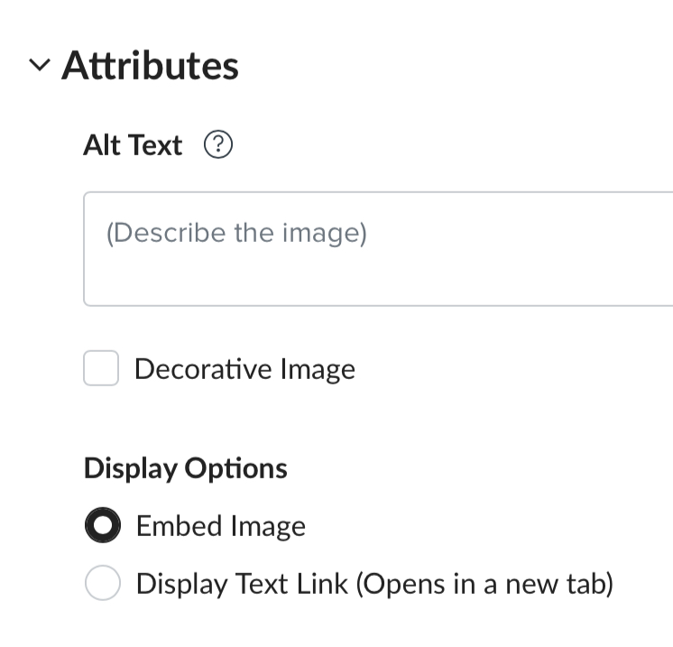

# Module 3: HTML – Multimedia

In this module, you will first learn what HTML attributes are – specifically, you will learn some common ways to supply metadata, or information, to HTML elements that determine what they show, how they look like, or how they behave. Then, you will learn about what digital accessibility is, why does it matter, and how your use of HTML elements can enhance (or hurt) digital accessibility. You will also learn about HTML elements that you can use to display multimedia – images and embedded webpages.

## Learning Outcomes

In this module, our content and activities will help you to be able to do the following:

- Explain what HTML attributes are
- Recognize common HTML attributes, including source `(src)`, in-line CSS style `(style)`, and alternative text (`alt`)
- Explain what digital accessibility is and how it pertains to HTML
- Create and customize the following HTML elements: image (``)
- Customize the following HTML elements: embedded webpage (`<iframe>`)

## Mini-Module 3.1: What is Digital Accessibility? 

### What is Digital Accessibility?

When your content is digitally accessible, it is usable by people with a wide range of dis/abilities. People who have disabilities benefit from digital accessibility practices especially, because your effort removes the challenges they face to access, use, and benefit from your content.

Not all disabilities are visible, such as color blindness and reading disabilities; in the context of your work in education, not all students choose to self-identify and seek accommodations.

As an employee at Ohio State, you are required ensure that the content you produce are digitally accessible. To paraphrase, OSU’s [Digital Accessibility Policy](https://das.osu.edu/sites/default/files/2020/11/policy-final-digital-accessibility-20210518.pdf) defines “accessible” as follows:

- Your users have the ability to obtain the same information;
- as fully, equally, and independently; and
- are afforded equal opportunity to the benefits.

Staying compliant is not just about keeping Ohio State out of legal trouble; **fundamentally, it is the right thing to do.**

### How does Digital Accessibility Apply to Your Web Content?

Some examples of web content that you produce as part your instructional design work include Carmen pages and H5P interactive content.

Ohio State’s [Minimum Digital Accessibility Standards (MDAS)](https://accessibility.osu.edu/digital-accessibility-policy/minimum-digital-accessibility-standards/) serve as the benchmark that your web content should meet. The MDAS is conveniently based on the Web Content Accessibility Guidelines, which outlines how you should use HTML in a way that enhances the digital accessibility of your web content.

> **ADA Title II Regulations**: On April 24, 2024, the U.S. Department of Justice released new ADA Title II regulations mandating that web content and mobile applications offered by public entities, such as Ohio State, conform to WCAG 2.1 level AA standards, with few exceptions, by April 24, 2026. See [New Title II Regulation Overview](https://accessibility.osu.edu/title-ii) and [Preparing for the New ADA Title II Digital Accessibility Requirements](https://accessibility.osu.edu/title-ii/how-to-prepare).

Here are some of the important standards from the MDAS that pertain to this training:

- Essential text must be available in formats other than visual
    - This text may be provided in code, which can then be programmatically converted via means such as text-to-speech and text-to-braille
    - For example, essential text in images are perceivable only visually, and thus not digitally accessible
- The structure of your web content must be defined programmatically
    - Including the use of logically sequenced headers, lists, well-defined data tables, and other elements that carry semantics
- Essential content must be sufficiently contrasted (e.g. color) against the background it is on
    - And colors must not be used as the sole method of conveying meaning

The highlighted standards will be referenced throughout the rest of the training.

## Mini-Module 3.2: HTML Attributes – Basics

You can customize how a HTML element should look and/or behave by using _attributes,_ which appear as part of its opening tag (or self-closing tag). You would typically supply a _value_ with an equal sign (`=`), wrapped in quotation marks (`"`), when you specify an attribute.

Look at the following code as an example:

- This is an inline container element (`<span>`)
- We’re specifying its style (`style`) attribute; you will learn about inline styling with CSS in a later module
- We’re supplying some styling (`"background-color: red"`) as its value

```html
<span style="background-color: red">
Some text in an inline container
</span>
```

Some attributes do not need to be supplied a value. For example, this is a built-in HTML video player (beyond the scope of this training) that is 320 pixels wide, 240 pixels tall, and uses the browser’s player controls; note that if multiple attributes are given, they are separated by spaces:

```html
<video width="320" height="240" controls>
    <!-- Omitted code -->
</video>
```

Some attributes (e.g. `alt` for alternative text) help users of assistive technology, such as screen and braille readers, with reading and understanding your web content. You will learn about the `alt` attribute in this module, and digital accessibility in a later module.

Many attributes are shared amongst HTML elements, and it’s likely that you’ll only work with a small subset of them. We’ll highlight a few of them in this training.

**Notes:**

- Some styling code, including the `width` and `height` attributes for ``, as well as the `border` and `cellpadding` attributes for `<table>`, can also be set in a HTML element’s `style` attribute, which you will learn about in a later module.
- Take a look at the `<video>` example again – the `controls` attribute is really supplied a value of `"true"` in the background, but this is beyond the scope of this training.
- The `<video>` and `<audio>` elements are not commonly seen in the Carmen RCE workflows, and they are beyond the scope of this training.

## Mini-Module 3.3: Images

You can insert an image into a webpage using the `` element:

- `` is an inline element
- An image’s source location, which may be a link, is supplied via the `src` attribute
- A concise description for the image is supplied via the `alt` attribute.
    - If an image is [_decorative_](https://www.w3.org/WAI/tutorials/images/decorative/) (i.e. does not have meaning or add new information), the `alt` attribute should still be set, and the value should be empty (`alt=""`)

Here is an example in HTML; note that `` is a self-closing tag:

```html

```

### In the WYSIWYG Editor

In the WYSIWYG editor, you can add an image by clicking the image icon on the formatting toolbar, or the “Image” option under the “Insert” menu. You will be asked to either supply alt text for an image, or mark it as decorative.

Checking “Decorative Image” will set the image’s `alt` attribute to empty (`""`).



(For reference, here is a no-narration video that demos [finding and editing an image’s alt text in both the WYSIWYG and HTML editors](https://mediasite.osu.edu/Mediasite/Play/b5152eb7861e4d58a2f557d20958da681d))

### Resources

- WebAIM provides a [resource on types of images and alt tag best practices](https://webaim.org/techniques/alttext/)

### Mini-Module 3.4: Embedded Webpages

You can embed another webpage into yours via an inline frame (`<iframe>`)

- `<iframe>` is an inline-level element
- The webpage to be embedded is supplied via the element’s `src` attribute
- A concise description for the content is supplied via the `title` attribute.

It is unlikely that you will write `<iframe>` code by hand; rather, you’ll insert `<iframe>` code generated by another tool, such as Mediasite, H5P, or YouTube.

Here is an example in HTML from H5P; for easier reading, arbitrary new lines have been added:

```html
<iframe
    src="https://otdi.h5p.com/content/[redacted]/embed"
title="Manic vs. Hypomanic Episode - CYH (BSSWK3600)">
    width="1088"
    height="841"
    frameborder="0"
allowfullscreen="allowfullscreen"
allow="autoplay *; geolocation *; microphone *; camera *; midi *; encrypted-media *"
    aria-label="Manic vs. Hypomanic Episode - CYH (BSSWK3600)"
</iframe>
```

### In the WYSIWYG Editor

You can insert embed code via the “cloud” embed icon on the formatting toolbar, or the “Embed” option under the “Insert” menu.
