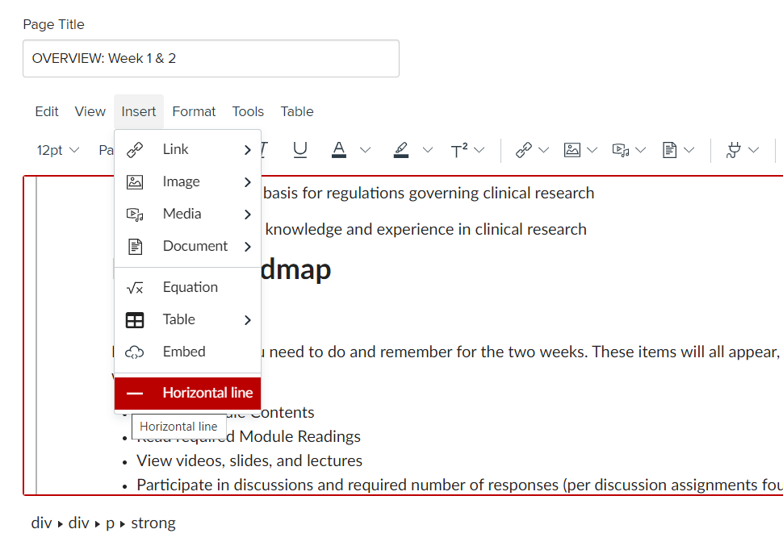
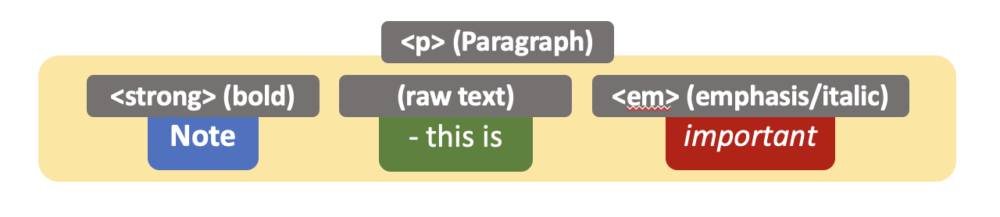
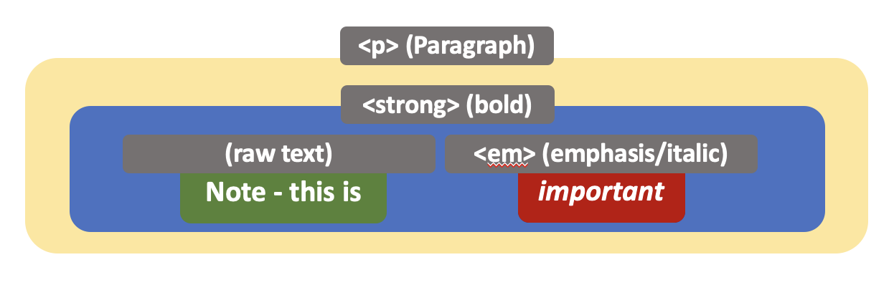
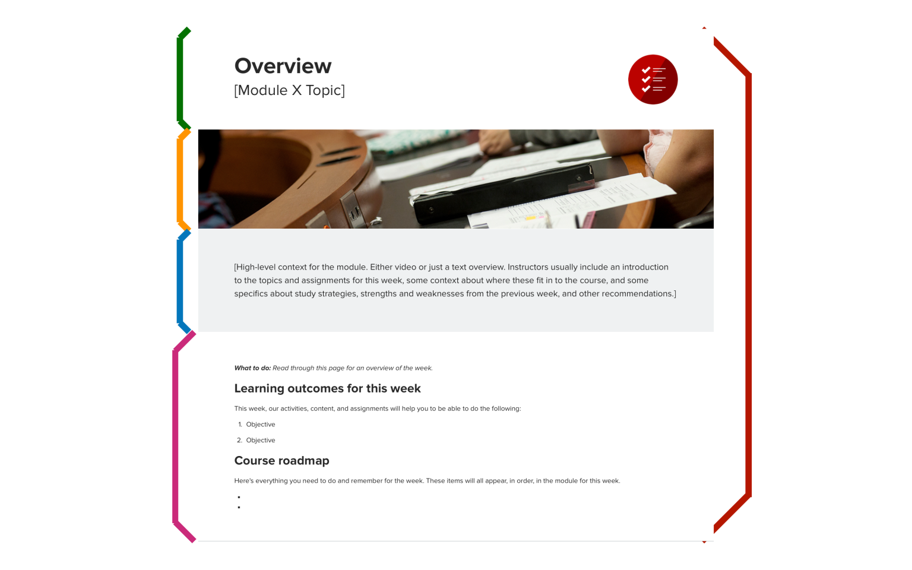
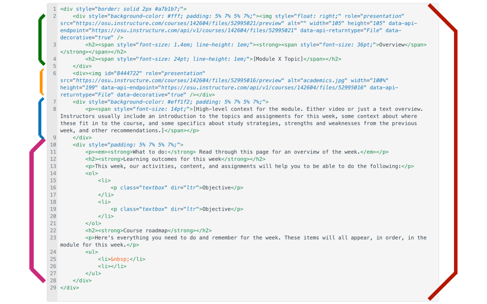

# Module 2: HTML – Text, Basic Formatting, and Containers

In this module, you will first learn about what HTML elements look like – this will help you recognize them and start differentiating different elements. Then, you will learn about HTML elements for text and containers. You will also learn about some HTML elements that you can use to format and organize text, including bold, italic, underline, line breaks, and horizontal lines.

## Learning Outcomes

In this module, our content and activities will help you to be able to do the following:

- Recognize a HTML element
- Create the following elements: paragraph (`<p>`), break line (`<br />`), horizontal lines (`<hr />`)
- Format text with the following elements: bold (`<strong>`), emphasized / italic (`<em>`), underlined (`<u>`), stricken (`<s>`), superscript (`<sup>`), subscript (`<sub>`)
- Recognize special characters in HTML, including white space (`&nbsp;`), left double quotation mark (`&ldquo;`), and right double quotation mark (`&rdquo;`)
- Explain the difference between inline- and block-level HTML elements
- Create HTML containers (`<div> and` <`span>`)

## Mini-Module 2.1: What Does An HTML Element Look Like?

This mini-module is meant for you to become familiar with how HTML looks – don’t worry, we’ll go over specific HTML elements later on in this module.

### Elements with Opening and Close Tags

Most HTML elements have an opening tag and a corresponding closing tag:

- The opening tag starts with `<` (less than sign), followed by the element’s name, and ends with `>` (greater than sign)
- The closing tag starts with `</` (slash and less than sign), followed by the element’s name, and ends with `>` as well

A HTML element’s content is wrapped in between its opening and closing tags; for example, here is a paragraph:

```html
<p>I am a paragraph.</p>
```

### Self-Closing Elements

Some elements are self-closing, meaning that they do not need a closing tag; rather, the (opening) tag ends with /> (slash and greater than sign). For example, here is a line break:

```html
<br />
```

As another example, here is an image:

```html

```

### Nested Elements

An HTML element can be contained inside another element (i.e. _nesting_, or “parent-child” relationship); for example, here is a paragraph containing bold text:

```html
<p><strong>This is a bolder sentence.</strong></p>
```

As another example, here is an arbitrary container with a paragraph inside:

```html
<div>
    <p>This is a container for many HTML elements.</p>
</div>
```

**Note**: you would typically add an indentation for every nesting level for ease of reading, but it is not required.

## Mini-Module 2.2: Paragraphs, Line Breaks, and Horizontal Lines 

A paragraph (`<p>`) is a block of text. By default, a paragraph is spaced away from content that comes before and after it – this will be explored further in the next mini-module.

In addition, you can use a line break (`<br />`) to _stylistically_ shift subsequent text in a paragraph to the next line; note that `<br />` is a self-closing element:

Finally, you can place horizontal lines (`<hr />`) within your content; for example, to visually separate two paragraphs; note that `<hr />` is a self-closing element:

Here is an example:

```
This is line 1 of the paragraph, and  
this is line 2.

This is a new paragraph.

---

This is yet another paragraph.
```

And here is how it is expressed in HTML code:

```html
<p>This is line 1 of the paragraph, and<br /> this is line 2.
<p>This is a new paragraph.</p>
<hr />
<p>This is yet another paragraph.</p>
```

### In the WYSIWYG Editor

In the WYSIWYG editor, “Paragraph” is the default text style.

**Line break**: You can create a line break by pressing the “Shift” and “Enter” keys at the same time. (On the other hand, just hitting “Enter” creates a new paragraph block)

**Horizontal line**: Click “Horizontal line” under the “Insert” menu.



(For reference, here is a no-narration video that demos the [difference between creating a new paragraph/list item by pressing “Enter” vs. creating a new line by pressing “Shift+Enter”](https://mediasite.osu.edu/Mediasite/Play/41010dbf90b14753a9c7bebde1e13a451d))

## Mini-Module 2.3: Basic Text Formatting and Special Characters

### Basic Text Formatting

Basic text formatting techniques include bold (`<strong>`), italics (i.e. emphasis, or `<em>`), underline (`<u>`), strikethrough (`<s>`), superscript (`<sup>`), and subscript (`<sub>`).

Here is an example: 

> **Note** – the ~~right~~ _correct_ way to write “x squared” is x2, and “y sub 1” is y1.

And here is how it is expressed in HTML code; for easier reading, arbitrary new lines have been added:

```html
<p>
<strong>Note</strong> - the
<s>right</s>
<em>correct</em> way to write
&ldquo;<u>x squared</u>&rdquo; is
x<sup>2</sup>, and
&ldquo;<u>y sub 1</u>&rdquo; is
y<sub>1</sub>.
</p>
```

**Note**: While beyond the scope of this mini-module, some of these formatting elements have a version with semantics (i.e. meaning), and a version purely for styling. You will learn about semantics of HTML elements later on in this training. For example:

- **Bold**: `<strong>` has semantics, `<b>` does not
- **Italics**: `<em>` has semantics, `<i>` does not; you may encounter the latter with icon fonts
- **Strikethrough**: `<del>` has semantics, `<s>` does not; the RCE uses the latter.

### Special Characters

You may have noticed that the quotation marks have been replaced with special code that starts with an ampersand (`&`) and ends with a semicolon (`;`). These are called special characters. Here are some common special characters you may encounter:

- Left double quotation mark (`&ldquo;`)
- Right double quotation mark (`&rdquo;`)
- Space (`&nbsp;`)

### In the WYSIWYG Editor

**Text formatting**: In the WYSIWYG editor, use the various formatting options on the formatting toolbar, or under the “Format” menu, to format text.

**Special characters**: When working in the RCE, you will rarely need to enter special characters directly in code – the HTML editor will actually automatically convert some special characters for you (e.g. quotation marks).

## Mini-Module 2.4: Inline vs. Block Elements

Take a second look at the examples and HTML code for [paragraphs](https://ohiostate.pressbooks.pub/otdidlsshtmlcsstraining/chapter/mini-module-2-2-paragraphs/) and [text formatting](https://ohiostate.pressbooks.pub/otdidlsshtmlcsstraining/chapter/mini-module-2-3-basic-text-formatting-and-special-characters/); note the following:

- `<p>This is a new paragraph.</p>`
    - This is how it looks like: "This is a new paragraph."
    - The paragraph is spaced away from content that comes before and after it
- `<p><strong>Note</strong> - this is <em>important</em></p>`
    - This is how it looks like: "**Note** - this is *important*"
    - The words in this paragraph are all on the same line, even though parts of it are in nested formatting elements



This is an example of inline vs. block elements. Another way to visualize this concept is a flow from top to bottom, and left to right: by default, a block element breaks the flow, whereas an inline element does not.

Here is a more advanced example where an inline element is nested inside another inline element:
- `<p><strong>**Note - this is** <em>_**important**_</em></strong></p>.`
- This is how it looks like: **Note - this is *important***



Where needed, inline-level elements are specifically identified in this training; for example, the [text formatting elements](https://ohiostate.pressbooks.pub/otdidlsshtmlcsstraining/chapter/mini-module-2-3-basic-text-formatting-and-special-characters/) introduced in this module are all inline elements. Text itself (i.e. plaintext) is also inline.

## Mini-Module 2.5: Containers

### Inline Container

The inline container `<span>` is commonly used for styling other inline elements, such as plaintext. In addition, the Carmen RCE uses `<span>` to apply some basic formatting options, including underline and strikethrough.

Here is an example:

> This is underlined, and this is ~~crossed out~~.

And this is how the RCE expresses it in code; for easier reading, arbitrary new lines have been added:

```html
<p>This is
<span style="text-decoration: underline;">underlined</span>, and this is
<span style="text-decoration: line-through;">crossed out</span></p>.
```

### Block Container

The block container `<div>` is commonly used for wrapping a group of elements inside a block (i.e. spaced away from content that comes before and after it).

Here is how a `<div>` might look like in HTML code:

```html
<div>
    <p>This is <strong>paragraph 1</strong></p>
    <p>This is <em>paragraph 2</em></p>
    <hr />
    <p>This is a <s>discarded paragraph</s></p>
</div>
```

### In the WYSIWYG Editor

**Inline container**: `<span>` is typically created as a result of applying styling. `<span>` can be deleted by removed styled content; _however_, it is strongly recommended that you do so using the code editor instead.

**Block container**: There is not a way to create or delete a `<div>` using the WYSIWYG editor.

### A Real-Life Example

Here is a real-life example using the [OTDI core template’s “Overview: Module X” page](https://osu.instructure.com/courses/59344/pages/overview-module-x?module_item_id=8343024), which contains one outer `<div>`, and four inner/nested `<div>`‘s. For easier identification, here are the opening tags for the `<div>`‘s:

- **Outer**: `<div style="border: solid 2px #a7b1b7;">`
- **Inner (header)**: `<div style="background-color: #fff; padding: 5% 7% 5% 7%;">`
- **Inner (banner)**: `<div>`
- **Inner (content)**: `<div style="padding: 5% 7% 5% 7%;">`



