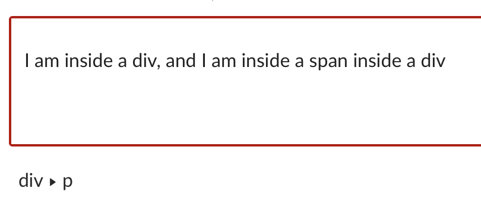
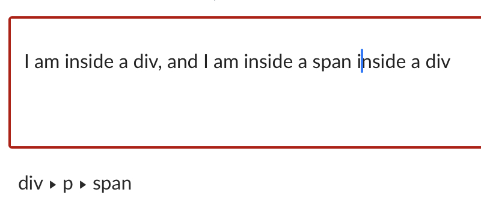
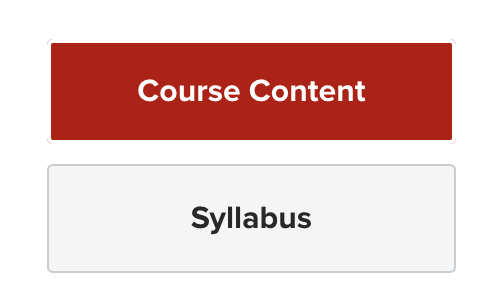
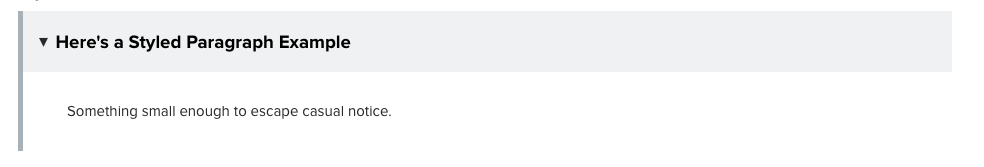
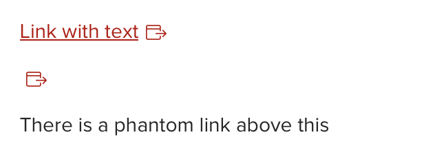

# Stepping Up: HTML & CSS

## Tips and Tricks for Working with Code in The Carmen RCE

### Finding Your Way in Code

`<span>` and <`div>` may be tricky to work with in the RCE:

- They may not be visible (e.g. no outlines)
- There may be phantom ones left over from cleaning up previous content that you can only delete in the code editor
- Sometimes hitting “Enter” at the bottom of a <`div>` may create the newline outside it.

The breadcrumbs (i.e. path to element) at the bottom left of the WYSIWYG editor may be helpful in this case to help you locate where you are.





Another helpful tip is typing some text in the WYSIWYG editor that are unlikely to be found elsewhere on the page (e.g. I like to smash my keyboard), and look for the text in the HTML editor.

(For reference, here is a no-narration video that demos [navigating the RCE breadcrumbs](https://mediasite.osu.edu/Mediasite/Play/0f05876773f34789b0436b7abe7484d51d))

### Enter/Return Key Not Creating New Line As Expected

A common symptom of this is when trying to create a new line at the bottom of a block container, the new line is created outside of it rather than inside.

This is sometimes caused by copied-and-pasted text not being wrapped in a paragraph (`<p>`) element. This can be corrected using the code editor.

### Phantom External Link Indicators

Carmen automatically inserts indicators following external links.

This is caused by edited/deleted links leaving empty link (`<a>`) elements in code. This can be correct using the code editor by locating empty link elements (e.g., nothing between `<a>` and `</a>`) and deleting them.

### Code Disappearing?

As a note for more advanced editors, the RCE doesn’t support some advanced HTML tags and CSS attributes. For more information, see [Allowed HTML and CSS in the Carmen RCE](https://community.canvaslms.com/t5/Canvas-Resource-Documents/Canvas-HTML-Editor-Allowlist/ta-p/387066).


## HTML Attributes – Class and ID

### Class

The `class` attribute is used to identify a group of HTML elements. A HTML element can have multiple classes, or no classes.

In terms of styling, a class can be used to style multiple HTML elements the same way. Carmen comes with some pre-styled classes that you can add to HTML elements using the RCE.

For example, a previous version of the Ohio State Online’s (OSO) Carmen course template has a “Course Content” link (`<a>`) that is styled to look like a button.

**NOTE**: This technique is offered as an example and is no longer recommended.



Here is how it is expressed in code; note that multiple classes are separated by spaces:

```html
<a class="btn btn-primary btn-block">Course Content</a> 
```

### ID

The `ID` attribute is used to uniquely identify a specific HTML element.

When working on OSO courses using the Carmen RCE, you will encounter the `ID` attribute in the HTML code including toggle buttons, content tabs, and jump links; in most cases as part of your work, you will _modify_ rather than _add_ `ID` attributes.

For example, this is how a paragraph (`<p>`) with an `ID` looks like in code:

```html
<p id="first_paragraph">This is the first paragraph</p>
```

**Note:** Providing styling for an HTML element with a specific ID attribute is possible; it is out of the scope of this training.

### More on Cascading: Styling by `ID` and/or `Class`

Recall from the “What Does Cascading Mean?” mini-module that the most specific CSS declaration for a given HTML element is the one that applies, even if there are inheritable properties.

In general, here’s the ranking from _least_ specific to _most_ specific:

1. (Inherited) Styles applied to the HTML element type (e.g. `<p>`)
2. Styles applied by class (e.g. `<p class="paragraphs_with_red_background">`)
3. Styles applied by ID (e.g. `<p id="first_paragraph">`)
4. Inline styles (e.g. `<p style="color: red;">`)

## Create In-Page Jump Links

Besides other webpages, links (`<a>`) can also be used to “jump” quickly to another location on the current page. This is done by giving a HTML element a unique value for its `id` attribute.

For example, you want to add a link for quickly jumping to the “intro” container (`<div>`).

Here is how it may look like in code; note that when you refer to an `id` as a value for the `href` attribute, add a pound sign (`#`) in front of it:

```html
<div id="maincontent">
    <a href="#intro">Jump to Introductions</a>
    <!-- Other Content -->
    <div id="intro">
        <h2>Introductions</h2>
        <a href="#maincontent">(Back to Top)</a>
        <!-- Section Content -->
    </div>
</div>
```

**Note**: Be mindful when you create in-page links that jumping around may be disorienting for some users.

### In the WYSIWYG

Neither in-page `href` values or `id's` can be added via the WYSIWYG editor.

(For reference, here is a no-narration video that demos [creating and using in-page jump links on a Carmen page](https://mediasite.osu.edu/Mediasite/Play/a7c8f7d10b924e439ff444f23d5c54bd1d))

## Create Collapsible Content 



Collapsible content, or “accordions”, are titled blocks of content that can be expanded and collapsed.

### Template Code

Copy and paste the provided template code into the code editor, then modify as needed.

**Note:** Additional CSS properties have been applied because the default stylings are minimal – can you tell what they are?

```html
<details style="margin-bottom: 5px; border-left: 5px solid #a7b1b7;">
  <summary style="background-color: #eff1f2; color: #000000; padding: 16px; font-size: 14pt;">[Title/label displayed for the content
  </summary>
    <div style="padding: 1rem 1rem 1rem 2.75rem;">
      <p>[Content]</p>
    </div>
</details>
```

### How Does It Work?

`<details>` and `<summary>` are HTML elements used together to create expandable/collapsible information blocks.

The `<details>` element is the outermost element, and it has two children elements:

- The `<summary>` element contains the title
- The `<div>` element is the container that holds the contents

### In the WYSIWYG Editor

Collapsible content cannot be created in the WYSIWYG editor; however, the contents can be edited with it.

## Replace an Image in the HTML Editor 

When working with a styled container and/or image, sometimes it’s easier, or even necessary, to replace the the image in code to preserve the styling.

For example, here is the code for the banner image on OSO’s template home page (an older version; the image ID is emphasized with three stars *):

```html
<!-- Abridged -->
<div>
        
</div>
<!-- Abridged -->
```

To replace the image in code:

1. Go to the Files page and upload the banner
2. Click the uploaded banner to open its preview
3. Look at the link in the address bar and copy the number after “`?preview=`“
4. Edit the page with the image that needs to be replaced; switch to the HTML editor
5. Replace the numbers in the `src` and `data-api-endpoint` attribute values, which appear after “`files/`“
6. While you are here, if applicable, you can also update the image’s `alt` attribute

### In the WYSIWYG

This cannot be done in the WYSIWYG editor.

## Delete Phantom Links

Phantom links are created when a link text appears to be deleted in the WYSIWYG editor, but the underlying `<a>` tag remains in code.



For example, here is a link with text, and a link without (i.e., a “phantom” link) – note that for phantom link the closing `<a/>` tag follows immediately after its corresponding opening `<a>` tag ; comments were added for clarify:

```html
<!-- Link with text -->
<a href="https://www.osu.edu">Link with text</a>
<!-- Phantom link -->
<a href="https://www.osu.edu"></a>
```

You can most reliably fix a phantom link in the HTML editor:

1. First, view the content and identify the phantom link’s location
2. In the HTML editor mode, locate content(s) surrounding the phantom link, then locate the phantom itself
3. Highlight the phantom link, the press the “backspace” or “delete” key to remove it

(For reference, here is a no-narration video that demos the [process of deleting a phantom link in the HTML editor](https://mediasite.osu.edu/Mediasite/Play/310434f5b890433baaed7230e250bf571d))

