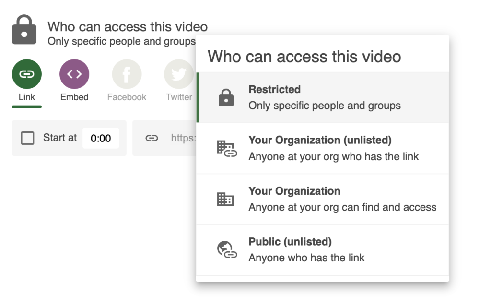

# Add a Panopto session to a course in CarmenCanvas

There are two main ways to add a Panopto video to a course in CarmenCanvas, with the main differences being workflow and [how permissions are handled](panopto-session-who-has-access).

## Without using the Panopto integration (LTI) for CarmenCanvas

You can **link or embed** via this method. Security permissions for a session shared this way are managed by **you**. Upon Carmen course copy, the permissions of a session shared this way will be **retained**.

To generate a link or embed code to an individual session:
1. Locate your session in the Panopto Video Library
2. Hover your mouse over a session to reveal its context menu. Click **Share** to open its settings popup
   
   
3. Under **Who can access this video**, click the **Change** link to open a popup
   
   
	1. Click **Public (unlisted)** if you want to give view access to anyone who has the link (to a page on which it is embedded); OR
	2. Click **Your Organization (unlisted)** to give view access to anyone at OSU, which will require an user to log in to watch it, and per-user viewing analytics will be recorded
4. To generate a link and/or embed code to the session:
	1. Click the **Link** button, then click the **Copy Link** button to copy the link
	   
	   
	2. Click the **Embed** button, optionally customize player settings, then click the **Copy Embed Code** button to copy the embed code
5. In Carmen:
	1. If you generated a link, you can [add it to a rich content area](https://community.canvaslms.com/t5/Instructor-Guide/How-do-I-create-hyperlinks-to-external-URLs-in-the-Rich-Content/ta-p/872) (e.g., pages, assignment/quiz instructions, discussion prompts/posts), or [add it to a Module](https://community.canvaslms.com/t5/Instructor-Guide/How-do-I-add-an-external-URL-as-a-module-item/ta-p/967)
	2. If you generated embed code, you can [embed it in a rich content area](https://community.canvaslms.com/t5/Instructor-Guide/How-do-I-embed-media-from-an-external-source-in-the-Rich-Content/ta-p/828)

## Using the Panopto integration (LTI) for CarmenCanvas

You can **embed** via this method. Security permissions for a session shared this way are managed by **the LTI**. Upon embed in a Carmen course, the course’s roster will be given view access to the session by the LTI. Upon Carmen course copy, the destination course’s roster will be given view access to the session by the LTI.

### Embed in a rich content area

To embed a session in a rich content area in a CarmenCanvas course:
1. Open a piece of rich content (e.g., pages, assignment/quiz instructions, discussion prompts/posts), then click its **Edit** button
2. On the rich content editor’s toolbar, click the “plug” **Apps** icon (you may need to reveal it by clicking the “3-dot” **More** icon), the click **View All**
   
   
3. From the **All Apps** popup, locate and click **Panopto Video**; this will open the **Panopto Video** picker
4. You can either **Choose**, **[Upload](panopto-upload-existing-video)**, or **[Record](panopto-record-new-session)** a session/video. To choose: 
	1. Locate a session you would like to embed (you may need to search and/or use the dropdown at the top to navigate to another folder)
	2. Click its radio button to select it
	3. Optionally customize its **Video Embed Options**, then
	4. Click the **Insert** button
	   
	   

### Embed in a module

To embed a session as a link in a Module in a CarmenCanvas course:
1. Go to the **Modules** page, locate the module to which you would like to embed the session, then click its “+” **Add Content** button
2. From the **Add Item** popup, use the dropdown at the top click and select **External Tool**
3. From the list of external tools, locate and click **Panopto**; this will open the **Panopto Video** picker
4. You can either **Choose**, **[Upload](panopto-upload-existing-video)**, or **[Record](panopto-record-new-session)** a session/video. To choose: 
	1. Locate a session you would like to embed (you may need to search and/or use the dropdown at the top to navigate to another folder)
	2. Click its radio button to select it
	3. Optionally customize its **Video Embed Options**, then
	4. Click the **Insert** button
	   
	   
	5. Optionally, customize **Page Name**, **Load in a new tab**, and/or **Indentation**. Then, click the **Add Item** button.

