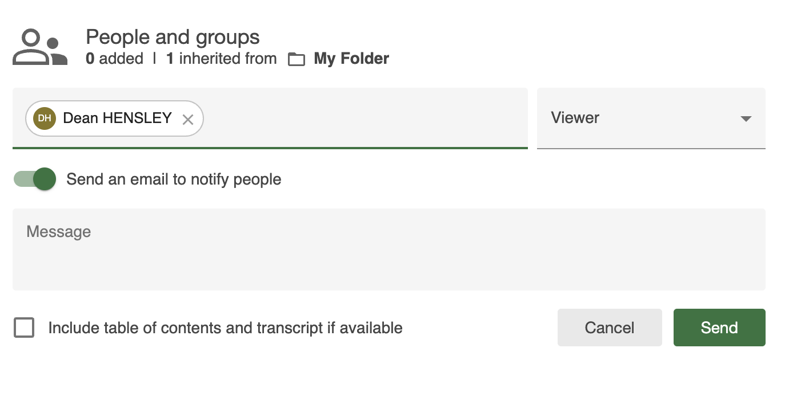
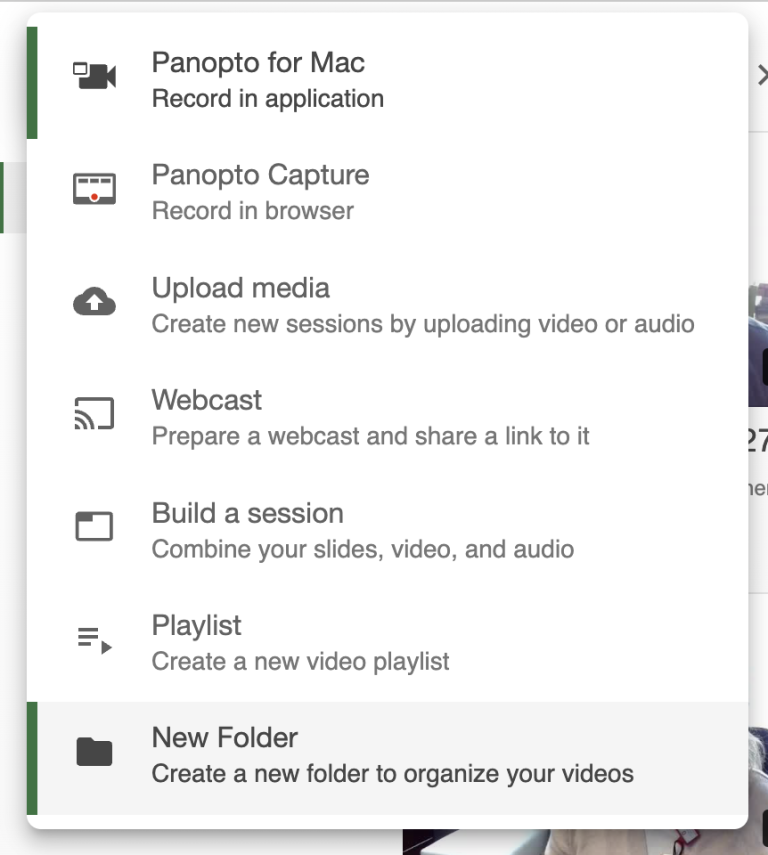
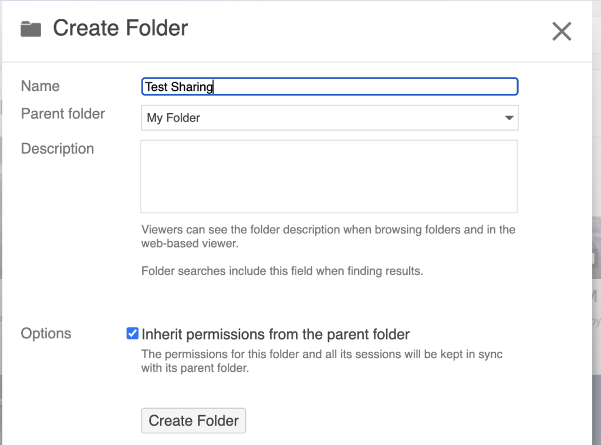

# Collaborate with instructors in Panopto

There are two options: 
* Give Viewer access to a single session in Panopto
* Give Creator and/or Viewer access to a folder in Panopto

## Give Viewer access to a single session in Panopto

Once a video has been uploaded to Panopto:
1. Locate the session in the Panopto Video Library
2. Hover your mouse over a session to reveal its context menu. Click **Share** to open its settings popup
   
   
3. Under **People and groups**, enter the instructor’s name or OSU email address in the text field; use the dropdown to select the correct result. Here are some notes:
   
   
	1. The instructor would need to log into Panopto at least once to establish their account
    2. If added as **Viewer,** which is the default, the instructor will be able to see and search for the session when they log into Panopto; on the other hand, if added as **Viewer with Link**, the instructor will only be able to access the session via link
4. Optionally, you can choose to notify the instructor via email, include a message, and/or include table of contents and transcript if available
5. Click the **Send** button to grant access

## Give Creator and/or Viewer access to a folder in Panopto

By default, a member of a folder has the same permissions to the sessions inside the folder as they do the folder. As example, we’ll create and share a subfolder in **My Folder**.

Once logged into Panopto:
1. Click the **+ Create** button at the top left, then click **New Folder**; this will open the **Create Folder** popup
   
   
2. Supply the following information:
   
   
	1. Enter **Name**
	2. Use the **Parent folder** dropdown to select the folder this new folder will be created under
	3. Optionally, enter **Description**
	4. By default, the **Inherit permissions from the parent folder** option is enabled; we’ll ignore it for now
3. Click the **Create Folder** button. This will open the **Share** tab of the folder’s settings popup – continue in the next section

To collaborate on a folder:
1. Use **My Folder** or **Browser** to locate the folder you would like to collaborate one. Click to open it.
2. Click the folders **Share** button (looks like a “less than” sign) at the top right; this will open the **Share** tab of the folder’s settings popup
3. Under **People and groups**, enter the instructor’s name or OSU email address in the text field; use the dropdown to select the correct result:
   
   
	1. If you do not see the text field, the folder is inheriting permissions from its parent folder. If it is appropriate, click the **Change** link to open the **Stop inheriting users and permissions** popup, leave **Keep [#] members as added users** checked, then click the **Stop Inheriting** button; note that this folder will no longer receive changes in membership and viewing permissions made to its parent folder
	2. The instructor would need to log into Panopto at least once to establish their account
	3. If added as **Viewer,** which is the default, the instructor will be able to see and search for the session when they log into Panopto; on the other hand, if added as **Viewer with Link**, the instructor will only be able to access the session via link
4. Optionally, you can choose to notify the instructor via email, include a message, and/or include table of contents and transcript if available
5. Click the **Send** button to grant access
