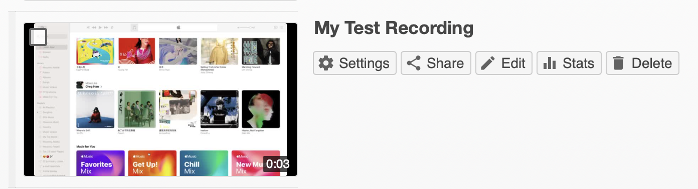

# Edit a session in Panopto

## Basic concepts

Here are some basic concepts:
- A session is composed of one or more streams (audio and/or video) and can include other content such as slides and quizzes
    - A stream can be primary or secondary. It is recommended that you recording your webcam+microphone as primary, and supporting visuals (e.g., desktop, app) as secondary, **especially** because there are editing implications:
        - Trims and cuts to a primary stream affects the entire timeline
        - Secondary streams can be edited independently
    - Primary video streams are marked as `P[#]`, and secondary streams are marked as `S[#]`, with # being a number
    - The slide stream is marked as **SL**
- Edits are made to a session’s **Timeline**, similar to in other video editors
- The cut mode is activated by default when editing
- Edits are non-destructive; using the top menu bar in the editor:
    - You can quickly **Undo**, **Redo**, and **Revert** (all) changes during an editing session
    - Edits are automatically saved; however, viewers won’t see the changes until you **Apply** them to the session
    - Changes can be undone manually across editing sessions

## Open session editor

Here’s how you can perform basic edits to a session’s content, including video streams:
1. Locate your session in the Panopto Video Library
2. Hover your mouse over a session to reveal its context menu. Click **Edit** to open the session editor in a new tab/window

## Trim beginning/end of the timeline

**Note**: Trimming a stream the length of the entire session affects the entire timeline; in other words, you can trim a secondary stream independently as long as it doesn’t start and/or end with the overall session. See the “cutting” section for a workaround.

In edit mode:
1. Hover your mouse over the beginning or the end of the timeline; a transparent black rectangle will appear, and your mouse pointer will turn into a two-way arrow “<->”
2. Drag and drop the black rectangle to set how much you would like trim

## Cut a section out of a stream

**Note**: Cutting a primary stream affects the entire timeline.

In edit mode:
1. Place your mouse where you would like to start cutting
2. Click the left mouse button, drag to where you would like to stop cutting, then release the left mouse button to confirm the cut
    1. You can go forwards (i.e., to the right) or backwards (i.e., to the left); this makes it a workaround for trimming the beginning and/or end of a single secondary stream
3. If needed, you can trim the cut, including removing the cut by dragging the start of the cut to the end of the cut (or vice versa)

## Fine-tune trims and cuts

You can fine-tune trims and cuts by specifying timestamps:
1. On the left menu, click to select **Cuts**
   
   
2. Locate the cut that you would like to fine-tune (e.g., session-wide edits are marked **Session**, and stream-specific edits are named after the stream). Hover your mouse over the cut entry, click its “3-dot” **More** menu, the click **Edit** (or **Delete**); the **Edit Cut** popup will open
   
   
3. Modify its **Cut start time** and/or **Cut end time**
4. Click the **Save** button to confirm

## Add and/or delete a stream

To add and/or delete a stream:
1. On the left menu, click to select **Streams**
   
   
2. To **delete** a stream, locate the stream that you would like to fine-tune. Hover your mouse over the stream entry, click its “3-dot” **More** menu, the click **Delete**
3. To **add** a stream:
   
   
	1. Click in the timeline where you would like to add the stream
	2. Click the **Add Stream** button
	3. Click either the **Upload primary audio or video** or the **Upload secondary video or PowerPoint** area; then, use your system’s file picker to select a file
4. You can optionally adjust a stream’s start time:
   
   
	1. Hover your mouse over the stream entry, click its “3-dot” **More** menu, the click **Edit**
	2. Modify its **Start time**
	3. Click the **Save** button to confirm

## Edit caption

To edit a session’s caption:
1. On the left menu, click to select **Captions**
2. Locate the segment that you would like to edit:
    1. Click the text to enter edit mode
    2. Click the “3-dot” **More** menu to **Edit** its **Start time** and/or **End time**, or to **Delete** it
    3. If needed, click a segment’s timestamp to seek the player to it
3. If you need to add a new segment to the caption:
    1. In the timeline, click where you would like to insert the segment
    2. Enter the new segment in the **Enter a caption** text box. Hit the **Enter** key to insert it

## Add audio description

To add text-to-speech audio description:
1. On the left menu, click to select **Audio Descriptions**
2. In the timeline, click where you would like to insert an audio description
3. Enter the new audio description in the **Enter audio description** text box. Hit the **Enter** key to insert it
4. To edit an audio description:
    1. Locate it in the list
    2. Click the text to enter edit mode
    3. Click the “3-dot” **More** menu to **Edit** its **Time**, or to **Delete** it
    4. If needed, click an audio description’s timestamp to seek the player to it

## Add slides and/or chapters

Slides and chapters are helpful for quick navigation to specific timestamps in a session:
- In some cases, Panopto may have automatically created “Smart Chapters” for you based on content within your session
- In addition, Panopto automatically captured if you check **Record PowerPoint** (or Keynote) while recording

To manually add chapters:
1. On the left menu, click to select **Contents**
2. In the timeline, click where you would like to insert a chapter
3. Enter the chapter name in the **Enter a table of contents entry** text box. Hit the **Enter** key to insert it
4. To edit an existing chapter:
    1. Locate it in the list
    2. Click the text to enter edit mode
    3. Click the “3-dot” **More** menu to **Edit** its **Time**, or to **Delete** it

**Note**: You can also follow this workflow to embed a [link](https://support.panopto.com/s/article/Embed-a-Web-Page-Using-the-Basic-Editor), a [YouTube video](https://support.panopto.com/s/article/Embed-a-YouTube-Video-into-a-Panopto-Session), or a [Panopto Quiz](https://support.panopto.com/s/article/How-to-Add-a-Quiz-to-a-Video) in the session.

To manually add slides:
1. On the left menu, click to select **Slides**
2. Click **Add a presentation**; select and upload a PowerPoint file from your device. You’ll see the slides once they have been processed
3. In the timeline, click where you would like to insert a slide
4. Locate the slide you would like to add, then click its “**+”** button
5. To edit an inserted slide:
    1. Locate it in the list
    2. Click its “3-dot” **More** menu to **Edit** its **Title** and/or **Time**, or to **Delete** it

