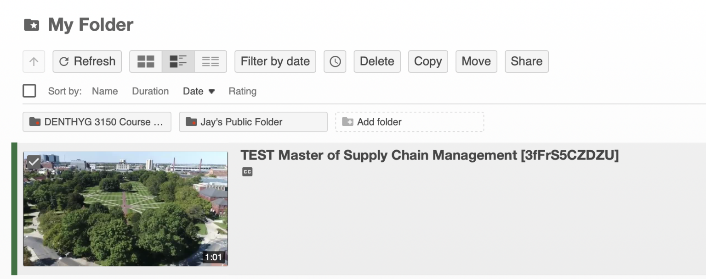
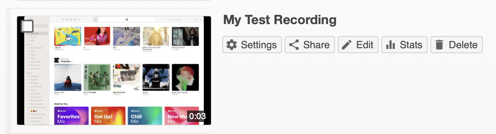
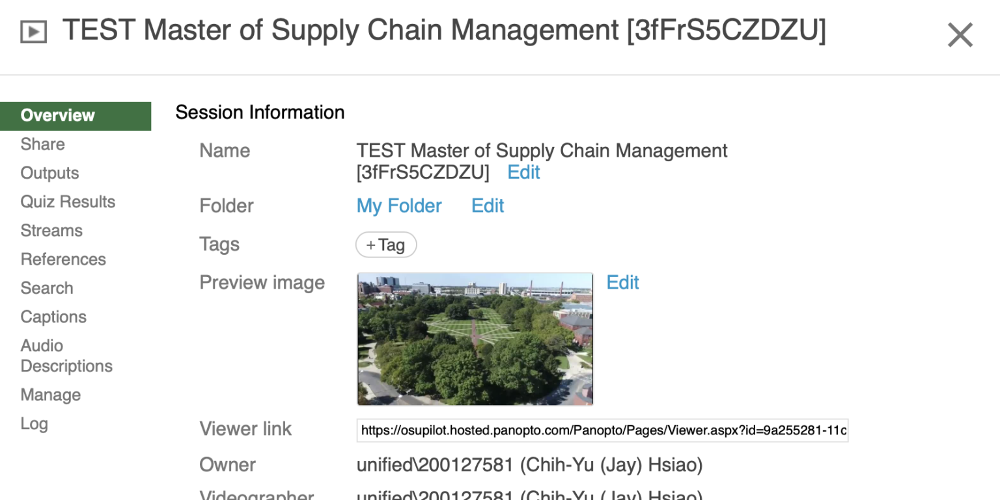

# Manage a session and its information in Panopto

## Perform session management actions

Here’s how you can perform session management actions, such as delete, copy, and move:
1. Locate your session in the Panopto Video Library
2. Click the session’s row to reveal additional buttons at the top of the page; you can also use the sessions’ checkboxes (top left of thumbnails) to select one or more sessions. Here are some actions you can perform:
   
   
	1. **Delete**: A deleted video is sent to the [**Recycle Bin**](https://support.panopto.com/s/article/Recycle-Bin-and-Permanently-Delete); retention length of such videos have yet to be determined. You can access the **Recycle Bin** by clicking the **System** link on the left menu
    2. **Copy:** Here are some additional notes
        1. You will be asked to select a folder to which you will make the copy
        2. By default, the copied video will have the same owner and availability settings as the original video. The copied video will also inherit viewer permissions from its folder
        3. This creates a [reference copy](https://support.panopto.com/s/article/Learn-About-Video-Reference-Copies), which references the original session but has its own viewer-contributed metadata. Making edits to a reference copy will turn it into a distinct session, as if you have created a full copy.
    3. **Move:** Alternatively, click the **Browse** link on the left menu to open the folder tree, click the “pin” icon at the top right of the pane so it doesn’t auto-hide, then drag and drop from the list of sessions
    4. **Share**: (See [Add a Panopto session to a course in CarmenCanvas](panopto-add-session-to-carmencanvas) and/or [Collaborate with instructors in Panopto](panopto-collaborate-with-instructor))

Management actions can also be performed from a sessions’ settings page (see the next section).

## Edit session information and viewer options

Here’s how you can edit a session’s information and viewer options:
1. Locate your session in the Panopto Video Library
2. Hover your mouse over a session to reveal its context menu. Click **Settings** to open its settings popup
   
   
3. Here are some relevant information fields and viewer options:
   
   
	1. **Overview**: (note that management options can also be found here)
	    1. **Name, Folder** (i.e., move the session), **Tags,** **Preview image** (one is automatically generated), **Description**
	    2. **Download:** who can download; default for **My Folder** is **Admins, videographers and creator only**
	    3. **Discussion:** enable/disable the ability to post comments, toggle whether commenting publicly is the default
	    4. **Availability:** you can set start and/or end dates
	2. **Share**: (See [Add a Panopto session to a course in CarmenCanvas](panopto-add-session-to-carmencanvas) and/or [Collaborate with instructors in Panopto](panopto-collaborate-with-instructor))
	3. **Outputs**: layouts of the viewer as well as the video podcast composite
	4. **Captions**: automated captions are requested for you

