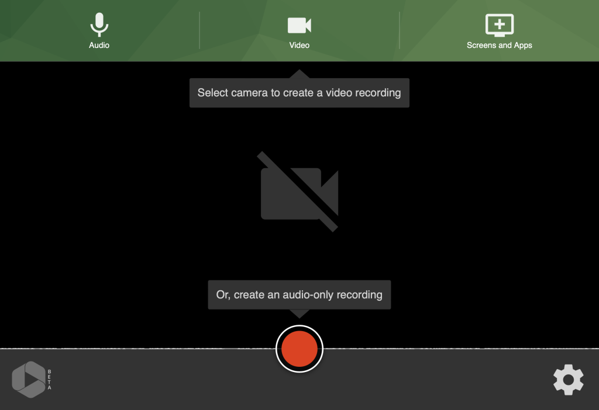

# Record a New Session for Panopto

Panopto provides two recording options for your work and personal machines:

- [Panopto Capture](https://support.panopto.com/s/article/How-to-Create-a-Video-Using-Panopto-Capture), which is available on desktop and mobile browsers without needing to install additional software (**Note:** iOS support was “coming soon” at the time of writing)
- [Panopto for Windows](https://support.panopto.com/s/article/basic-recording-1) or [Panopto for Mac](https://support.panopto.com/s/article/Recording-with-Panopto-for-Mac), which needs to be installed on your device (**Note:** for managed devices, consult with your local IT support)

Either option is great for recording audio, video, an application, and/or your desktop. We think Panopto Capture should suffice for most use cases.

Here is how to record a new session to Panopto using Panopto Capture.

## Record using Panopto Capture

To record a new session using Panopto Capture:
1. From the Panopto website, click the **+ Create** button at the top left, then click **Panopto Capture**; a new tab or window will open _(Alternatively, from the Panopto Video page in a Carmen course, click the **+ Create** button at the top)._ Depending on your system and browser, you may be asked to give Panopto Capture permission to use your microphone(s) and camera(s), as well as to record your desktop; such prompts typically takes the form of a popup
   
   
   
2. Use the buttons at the top to confirm what you would like to record:
	1. **Audio:** Microphone source
	2. **Video**: Camera source(s); note that the first camera selected will be the primary video source
	    1. **Tip**: Before recording, you can hover your mouse over your camera feed, and click the picture-in-picture icon to pop it out so you can preview it while recording (solid rectanble inside a outlined rectangle). Note that if you are also recording your screen, this preview will be included
	3. **Screens and Apps**: App window(s) and/or screen(s)
3. Click the “gear” settings button to confirm recording settings
    1. Under **Recording options**, check **Enable 5 second countdown** if desired
    2. It is recommended that you do a test recording before the actual run. If needed, increase recording quality under **Recording options**; note that this will increase recording file size, which may in turn affect viewing experience
4. Click the “red circle” record button at the bottom center to start recording, and the “red square” stop button to stop
5. When done, you will have opportunity to edit the session information and/or edit the session itself:
   
   
	1. Top left
	    1. Close the window or tab when you see the following message – **Getting your video ready for editing: It’s safe to close your browser window**
	    2. Preview the video in consolidated form (i.e., all content in one video)
	2. Top right
	    1. **Redo** (i.e., discard) the video, or **Record New** video (top right)
	    2. Edit the session name
	    3. Select the folder in which the new session should be placed
	    4. Add tag(s) to the session
	    5. Add description for the session
	    6. **Edit** the session with a basic yet capable timeline-based editor
	    7. **View** the session in the Panopto viewer (i.e., how viewers will watch it)
	3. Bottom
	    1. **Send** the session to a user or a group in OSU’s Panopto instance, or an email address
	    2. **Manage (direct) Access** to the session

### Resume an existing session

You can extend an existing session by “resuming” it:

1. Locate your session in the Panopto Video Library
2. Hover your mouse over the session, and click **Settings**, which will open a new popup
3. Under **Overview**, scroll to the **Actions** section, and select either **Resume in Capture** or **Resume in Panopto for Windows/Mac**

