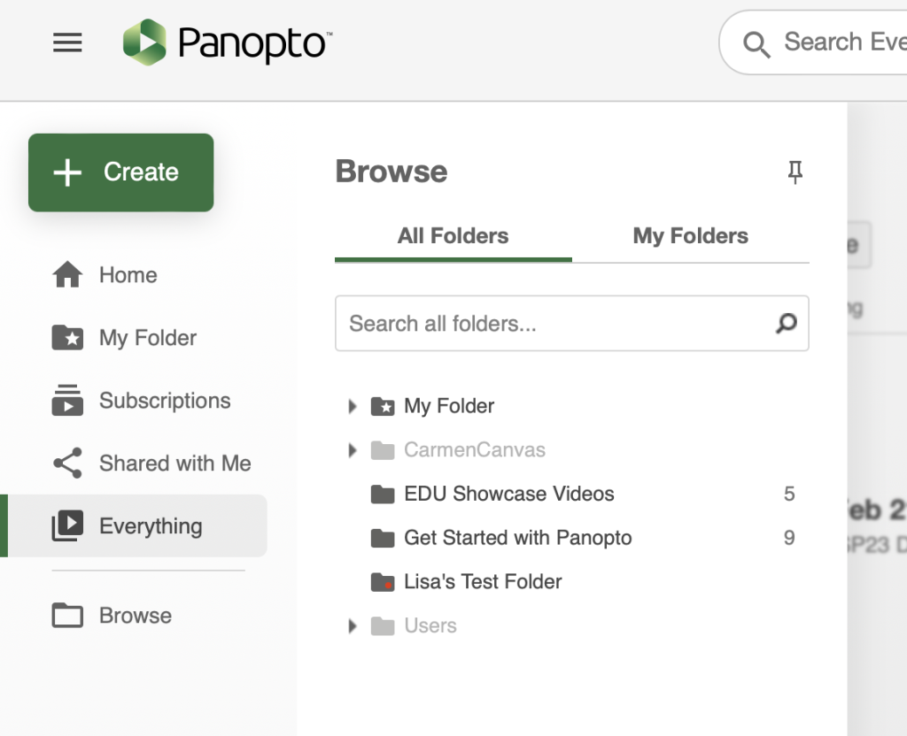
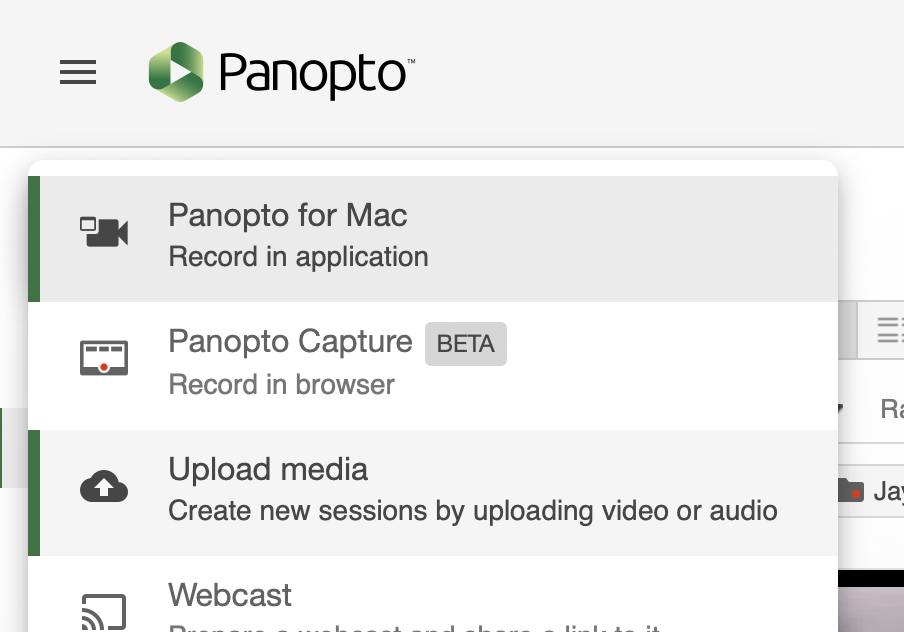
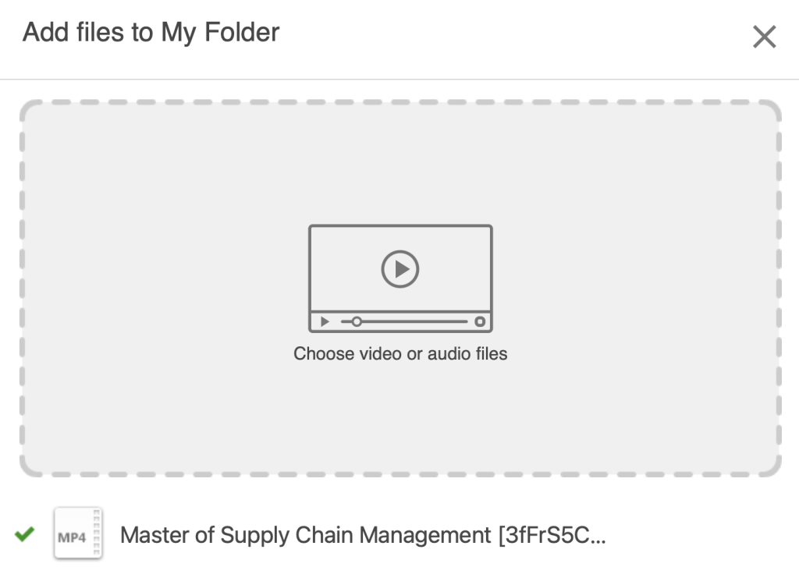

# Upload an existing video to Panopto

Here is how to upload an existing video to Panopto:
1. From the Panopto website, click the **+ Create** button at the top left, then click **Upload Media.** An **Add files to** popup will open _(Alternatively, from the Panopto Video page in a Carmen course, click the **+ Create** button at the top)_
   
   
   
   
2. Use the dropdown at the top to confirm or select the folder to which you would like to upload the video
3. Click the **Choose video or audio files** area; your operating system’s file picker will open. Select the video(s) you would like to upload. A message will indicate when uploading is complete and you can close the popup. 
	1. Your video will need to be processed by Panopto first, and the processing time may vary
	2. By default, the name of the new session will be the same as the video’s filename 
	   
	   
4. Use the My Folder or Browse page to confirm that your video has been uploaded and processed.
	1. By default, new sessions created in **My Folder** are only accessible by you. For information on sharing, see [Add a Panopto session to a course in CarmenCanvas](panopto-add-session-to-carmencanvas) and/or [Collaborate with instructors in Panopto](panopto-collaborate-with-instructor)
	2. For information on managing a session and its information (e.g., name), see [Manage a session and its information in Panopto](panopto-manage-a-session)
	3. For information on editing a session, see [Edit a session in Panopto](panopto-edit-session)
